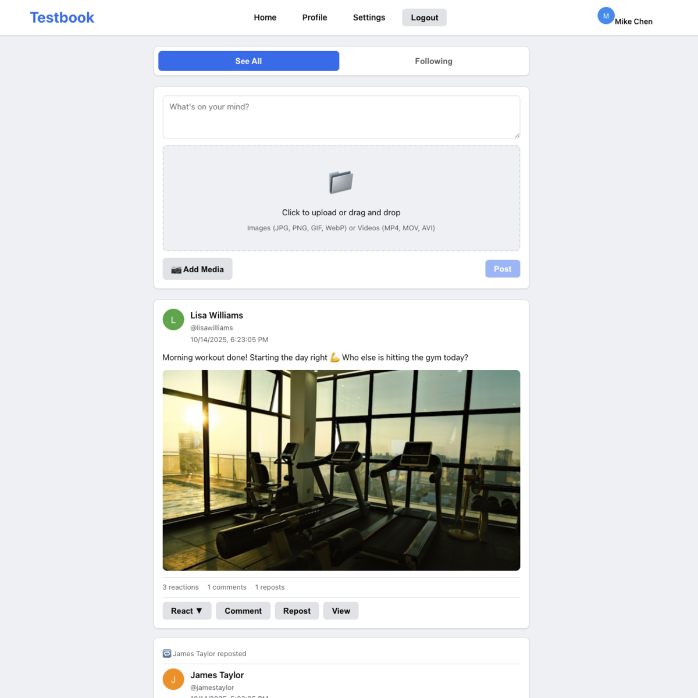
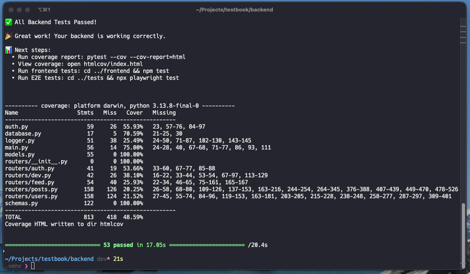
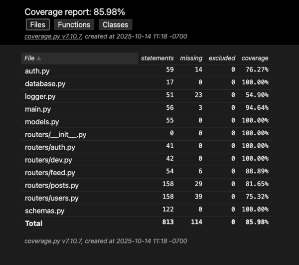
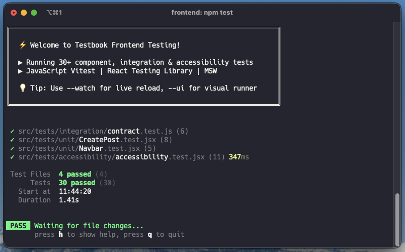
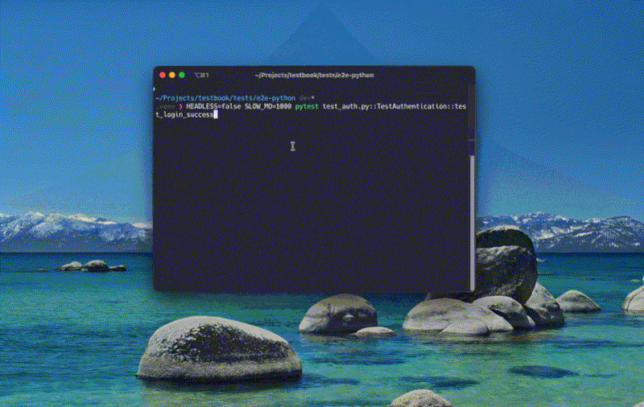

# 📱 Testbook - Automation Testing Platform


A production-grade social media application built for learning and practicing automation testing. Features 180+ backend tests, 30 frontend tests, comprehensive E2E coverage, and structured hands-on labs.

Perfect for individual learners, junior developers exploring testing, or manual QA professionals transitioning to automation.

**✅ 210+ Tests | Complete Testing Pyramid | 86% Backend Coverage | Production-Ready**

---

## 🚀 Quick Start (5 Minutes)

**Development mode** (commands below) runs on port 3000 and works with all tests.

Choose your operating system:

### macOS / Linux

```bash
git clone https://github.com/upt3mpo/testbook.git
cd testbook
chmod +x start-dev.sh
./start-dev.sh
```

### Windows

```bat
git clone https://github.com/upt3mpo/testbook.git
cd testbook
start-dev.bat
```

**That's it!** Open **<http://localhost:3000>** (not 8000!)

**📝 Note:** There's also `start.sh` for production (Docker), but use `start-dev.sh` for learning. See [WHICH_START_SCRIPT.md](WHICH_START_SCRIPT.md) for details.

---

## 🎓 Learn Automation Testing

### 🌟 **New to Testing? Start Here!**

**→ [Self-Guided Learning Path](learn/)** - 🆕 **5-Stage Curriculum** (12-18 hours, self-paced)

The complete journey from beginner to job-ready:

- 🧪 Stage 1: Unit Tests
- 🧱 Stage 2: Integration Tests
- 🌐 Stage 3: API & E2E Testing
- 🚀 Stage 4: Performance & Security
- 🎓 Stage 5: Job-Ready Capstone

---

### 🗺️ Choose Your Path

Pick the track that matches your background and goals:

| Path | Language Focus | Tools You'll Master | Time | Best For | Start Here |
|------|---------------|---------------------|------|----------|------------|
| **🐍 Python Track** | Python | pytest, Playwright Python, k6 | 12-15 hours | Backend developers, API testing | [Stage 1](learn/stage_1_unit/) |
| **☕ JavaScript Track** | JavaScript | Vitest, Playwright JS, MSW | 14-17 hours | Frontend developers, React teams | [Lab 1](labs/LAB_01_Your_First_Test.md) then [Stage 1](learn/stage_1_unit/) |
| **🔄 Hybrid Track** | Python + JavaScript | All tools from both stacks | 15-18 hours | Full-stack QA, most realistic | [Stage 1](learn/stage_1_unit/) |
| **⚡ Manual QA Transition** | Python-first | pytest, Playwright, automation mindset | 20-25 hours | Manual testers going automation | [Manual QA Guide](docs/guides/MANUAL_QA_TO_AUTOMATION.md) |

**Not sure?** Try the [Hybrid Track](learn/stage_1_unit/) - it's what most real QA roles need!

---

### ⚡ Setup TL;DR

```bash
git clone https://github.com/upt3mpo/testbook.git && cd testbook
./start-dev.sh          # macOS/Linux | start-dev.bat for Windows
# Open http://localhost:3000 → Start learning!
```

**Having issues?** → [Troubleshooting Guide](docs/guides/TROUBLESHOOTING.md) - Real errors with exact fixes

---

**Four ways to learn:**

1. **🎓 Self-Guided Learning Path** - **[RECOMMENDED]** Structured 5-stage curriculum
2. **🧪 Hands-On Labs** - Step-by-step tutorials, practice specific skills
3. **📚 Course Material** - Progressive curriculum with detailed context
4. **🔍 Self-Exploration** - Run tests, learn by example

### What's Available

✅ **🆕 [Self-Guided Learning Path](learn/)** - **[RECOMMENDED]** 5-stage curriculum to job readiness
✅ **[Hands-On Labs](labs/)** - 9 step-by-step tutorials (including advanced!)
✅ **[Structured Course](docs/course/COURSE_AUTOMATION_TESTING_101.md)** - Detailed curriculum with theory
✅ **🆕 [Portfolio Guide](docs/guides/PORTFOLIO.md)** - Turn your learning into job-ready portfolio content
✅ **🆕 [Quality Checks](docs/guides/QUALITY_CHECKS.md)** - Code standards with linting, formatting & coverage gates
✅ **🆕 [Accessibility Testing](docs/guides/ACCESSIBILITY_TESTING.md)** - WCAG 2.1 compliance with axe-core & Lighthouse
✅ **[210+ Executable Tests](docs/guides/RUNNING_TESTS.md)** - Complete test suite across both stacks
✅ **🆕 [Advanced E2E Patterns](docs/course/SECTION_08_ADVANCED_E2E_PATTERNS.md)** - Professional testing
✅ **🆕 [Testing Comparison Guide](docs/guides/TESTING_COMPARISON_PYTHON_JS.md)** - Python ↔ JavaScript
✅ **[Manual QA Transition Guide](docs/guides/MANUAL_QA_TO_AUTOMATION.md)** - For manual testers
✅ **[Task Runner](docs/guides/TASK_RUNNER.md)** - Simplified commands (Make/just)
✅ **[Quick Reference Guides](docs/reference/)** - Pytest & Playwright cheat sheets
✅ **[DevContainer Support](.devcontainer/)** - One-click setup

---

## 🧪 Complete Testing Pyramid

We test at every level - backend, frontend, E2E, API, security, and performance!


*Testbook running in development mode with seeded test data*

### Backend Testing (Python + pytest)

**166+ tests covering:**

- ✅ Unit tests (models, auth, utilities)
- ✅ Integration tests (database operations)
- ✅ API tests (all endpoints)
- ✅ Contract tests (property-based with Schemathesis)*
- ✅ Security tests

*Contract test currently skipped pending OpenAPI 3.1.0 support. See [Contract Testing Guide](docs/guides/CONTRACT_TESTING.md) to learn about this powerful testing technique.

```bash
cd backend
pytest -v                    # Run all 180 tests (1 skipped)
```


*180 backend tests running with 86% code coverage*


*Detailed HTML coverage report showing tested code paths*

### Frontend Component Testing (JavaScript + Vitest)

**30+ tests covering:**

- ✅ React component rendering
- ✅ User interactions
- ✅ Form validation
- ✅ Accessibility (WCAG compliance)
- ✅ Keyboard navigation
- ✅ Contract validation

```bash
cd frontend
npm test                     # Run component tests
npm run test:a11y            # Accessibility tests
```


*30 frontend tests with Vitest, React Testing Library, and MSW*

### End-to-End Testing (Choose Your Language!)

**Playwright (Python)** - Recommended for Python devs 🐍

```bash
cd tests/e2e-python
pip install -r requirements.txt
playwright install chromium
pytest -v
```

**Playwright (JavaScript)** - Recommended for JS devs ☕

```bash
cd tests/e2e
npm install
npx playwright install chromium
npm test
```


*Playwright automating browser interactions - login flow in action*

**Both?** - Recommended for well-rounded testers! 🚀

- Try Python version first
- Then JavaScript version
- Compare and learn both!

**Other Tools:**

- **Selenium** - Supported (any language)
- **Cypress** - Supported (JavaScript only)

### Platform-Specific Notes

| Platform | Start Command | Python Activation | Notes |
|----------|---------------|-------------------|-------|
| **macOS** | `./start-dev.sh` | `source .venv/bin/activate` | Use Terminal |
| **Linux** | `./start-dev.sh` | `source .venv/bin/activate` | Use Terminal |
| **Windows** | `start-dev.bat` | `.venv\Scripts\activate` | Use CMD or PowerShell |

---

## 📚 Documentation (Organized!)

### Essential (Start Here)

- **[START_HERE.md](START_HERE.md)** - Choose your learning path ⭐
- **[QUICKSTART.md](QUICKSTART.md)** - Get app running in 5 minutes
- **[FAQ.md](FAQ.md)** - Quick answers to common questions & troubleshooting
- **[WHICH_START_SCRIPT.md](WHICH_START_SCRIPT.md)** - Dev vs production explained
- **This file** - Project overview

### For Learning

- **[Learning Path](docs/course/COURSE_AUTOMATION_TESTING_101.md)** - Structured curriculum
- **[Labs](labs/)** - Hands-on tutorials
- **[Learning Paths](docs/course/LEARNING_PATHS.md)** - Choose path for your background
- **[Running Tests Guide](docs/guides/RUNNING_TESTS.md)** - How to run everything
- **[Common Mistakes](docs/course/COMMON_MISTAKES.md)** - Avoid common errors

### For Reference

- **[Testing Guide](docs/guides/TESTING_GUIDE.md)** - Comprehensive examples
- **[Pytest Quick Reference](docs/reference/QUICK_REFERENCE_PYTEST.md)** - One-page pytest guide
- **[Playwright Quick Reference](docs/reference/QUICK_REFERENCE_PLAYWRIGHT.md)** - One-page Playwright guide
- **[Cheat Sheet](docs/reference/TESTING_CHEATSHEET.md)** - Quick lookups
- **[Testing Patterns](docs/reference/TESTING_PATTERNS.md)** - Advanced techniques
- **[Testing Anti-Patterns](docs/reference/TESTING_ANTIPATTERNS.md)** - What NOT to do
- **[Debugging Guide](docs/reference/DEBUGGING_GUIDE.md)** - Debug like a pro
- **[API Reference](docs/reference/PROJECT_INFO.md)** - Technical details

### New Guides ✨

- **[Task Runner Guide](docs/guides/TASK_RUNNER.md)** - Simplified commands (Make/just)
- **[Logging & Observability](docs/guides/LOGGING.md)** - Structured logging
- **[Rate Limiting](docs/guides/RATE_LIMITING.md)** - Configuration & tuning
- **[Manual QA → Automation](docs/guides/MANUAL_QA_TO_AUTOMATION.md)** - Career transition guide

---

## ✨ Features

### Social Media Features

- ✅ User authentication & profiles
- ✅ Posts (text, images, videos)
- ✅ Comments & reactions (6 types)
- ✅ Follow/unfollow users
- ✅ Block/unblock users
- ✅ Feed filtering (All / Following)
- ✅ Reposts
- ✅ Theme switching (dark/light)
- ✅ Settings management

### Testing Features

- ✅ 138+ data-testid attributes
- ✅ Dev API for test data management
- ✅ Database reset functionality
- ✅ Predictable seed data
- ✅ File upload testing
- ✅ Cross-platform scripts

---

## 🧪 What Can You Test?

### Backend (Python/pytest) - 166+ Tests

- ✅ Unit tests (password hashing, JWT tokens)
- ✅ Integration tests (all API endpoints)
- ✅ Database tests (models, relationships)
- ✅ Contract tests (OpenAPI schema validation)
- ✅ Security tests (auth, input validation)
- **84% code coverage achieved**

### Frontend Component (JavaScript/Vitest) - 13 Tests ✨

- ✅ Component rendering tests
- ✅ User interaction tests
- ✅ Form validation tests
- ✅ **Accessibility tests (WCAG compliance)**
- ✅ **Keyboard navigation tests**

### End-to-End (Playwright) - 60+ Tests

- ✅ Complete user flows
- ✅ Cross-browser testing (Chrome, Firefox, Safari)
- ✅ Mobile testing
- ✅ Visual regression
- Available in **both Python and JavaScript**

### API Testing (Multiple Tools)

- ✅ Postman/Newman collections
- ✅ Python requests examples
- ✅ **Schemathesis contract testing**
- ✅ Any HTTP client supported

### Performance (K6)

- ✅ Smoke tests
- ✅ Load tests
- ✅ Stress tests
- ✅ Spike tests

### Security

- ✅ Authentication/authorization tests
- ✅ Input validation tests
- ✅ OWASP best practices
- ✅ 23+ security test scenarios

---

## 🎯 Quick Commands

### Using Task Runners (Recommended) ✨

**Make (Traditional):**

```bash
make setup          # Complete setup
make start          # Start both servers
make test           # Run all tests
make test-backend   # Backend only
make test-frontend  # Frontend only
make test-e2e       # E2E only
make coverage       # Generate coverage

```

**Just (Modern):**

```bash
just setup          # Complete setup
just start          # Start both servers
just test           # Run all tests
```

See **[Task Runner Guide](docs/guides/TASK_RUNNER.md)** for all commands.

### Platform-Specific Commands

**macOS / Linux:**

```bash
# Start app
./start-dev.sh

# Reset database
./reset-database.sh

# Run tests
cd backend && source .venv/bin/activate && pytest -v
```

**Windows:**

```bat
REM Start app
start-dev.bat

REM Reset database
reset-database.bat

REM Run tests
cd backend
.venv\Scripts\activate
pytest -v
```

### Language-Specific Testing

**Prefer Python?**

```bash
# Backend testing (Python/pytest)
cd backend && pytest -v

# Security testing (Python)
pytest tests/security/ -v

# API testing (Python)
python tests/api/python_api_examples.py
```

**Prefer JavaScript?**

```bash
# E2E testing (JavaScript/Playwright)
cd tests/e2e && npm test

# API testing (JavaScript/Postman)
newman run tests/api/Testbook.postman_collection.json

# Performance testing (K6/JavaScript)
k6 run tests/performance/smoke-test.js
```

**Learn Both? (Recommended!)**

```bash
# Python backend + Python E2E
cd backend && pytest -v
cd ../tests/e2e-python && pytest -v

# JavaScript E2E for comparison
cd ../e2e && npm test

# Now you know both! 🚀
```

---

## 👥 Test Accounts

Pre-seeded accounts with known passwords:

| Email | Password | Platform |
|-------|----------|----------|
| <sarah.johnson@testbook.com> | Sarah2024! | All |
| <mike.chen@testbook.com> | MikeRocks88 | All |
| <emma.davis@testbook.com> | EmmaLovesPhotos | All |
| <newuser@testbook.com> | NewUser123! | All |

---

## 🏗️ Tech Stack

**Backend:** FastAPI (Python) | SQLAlchemy | SQLite | JWT
**Frontend:** React 18 | Vite | React Router
**Testing:** pytest | Playwright | K6 | Postman
**DevOps:** Docker | GitHub Actions

---

## 🐛 Troubleshooting

### Cross-Platform Issues

**Port already in use:**

```bash
# macOS/Linux
lsof -ti:8000 | xargs kill

# Windows
netstat -ano | findstr :8000
taskkill /PID <PID> /F
```

**Permission denied on scripts:**

```bash
# macOS/Linux
chmod +x *.sh

# Windows: Run as Administrator
```

**Python venv issues:**

```bash
# macOS/Linux
python3 -m venv .venv
source .venv/bin/activate

# Windows
python -m venv .venv
.venv\Scripts\activate
```

See [docs/guides/RUNNING_TESTS.md](docs/guides/RUNNING_TESTS.md) for complete troubleshooting.

---

## 📞 Getting Help

### Quick Troubleshooting

- **[FAQ.md](FAQ.md)** - Common issues solved
- **[COMMON_MISTAKES.md](docs/course/COMMON_MISTAKES.md)** - Common errors cataloged
- **[DEBUGGING_GUIDE.md](docs/reference/DEBUGGING_GUIDE.md)** - Step-by-step debugging

### Learning Resources

1. **Starting out?** → [START_HERE.md](START_HERE.md)

2. **Running tests?** → [docs/guides/RUNNING_TESTS.md](docs/guides/RUNNING_TESTS.md)
3. **Learning?** → [labs/](labs/) or [docs/course/](docs/course/)
4. **Pytest commands?** → [docs/reference/QUICK_REFERENCE_PYTEST.md](docs/reference/QUICK_REFERENCE_PYTEST.md)
5. **Playwright commands?** → [docs/reference/QUICK_REFERENCE_PLAYWRIGHT.md](docs/reference/QUICK_REFERENCE_PLAYWRIGHT.md)

### Contributing

- **Want to help?** → [CONTRIBUTING.md](CONTRIBUTING.md)
- **Report issues** → Create GitHub Issue
- **Suggest improvements** → Create GitHub Discussion
- **Documentation changes** → Run `./scripts/check-markdown.sh` before committing

**Automated CI Checks:**

- ✅ Markdown linting & link validation
- ✅ Backend tests (pytest)
- ✅ E2E tests (Playwright)
- ✅ Security tests
- ✅ Code coverage (80%+ required)

---

## 📄 License

MIT License - Use freely for learning and testing!

---

## 🎓 Ready to Learn?

**→ [START_HERE.md](START_HERE.md)** - Begin your testing journey!

**→ [labs/LAB_01_Your_First_Test.md](labs/LAB_01_Your_First_Test.md)** - Write your first test in 30 minutes!
