# Windows Setup Guide

This guide helps Windows users set up and run Testbook from scratch, even if you have no development environment installed.

There are three approaches you can use:

## ⚡ Ultra-Quick Start

**Not sure which path to take?** Use this decision tree:

```mermaid
%% ────────────────────────────────────────────────
%% Testbook Ultra-Quick Start Flowchart
%% ────────────────────────────────────────────────
flowchart TD
    %% Root
    A(["🚀 **Which describes you?**"]):::title

    %% Level 1
    A --> B["🧩 New to coding or testing?"]:::question
    A --> C["💻 Experienced developer?"]:::question
    A --> D["☁️ Need a production-like environment?"]:::question

    %% Level 2
    B --> E["🪟 **Native Windows**<br/>(~5 minutes)"]:::option
    C --> F["🐧 **WSL (Linux)**<br/>(~10 minutes)"]:::option
    D --> G["🐋 **Docker (Container)**<br/>(~5 minutes)"]:::option

    %% Styling
    classDef title fill:#222,color:#fff,stroke:#555,stroke-width:1px,font-size:18px,font-weight:bold
    classDef question fill:#30363d,color:#fff,stroke:#666,stroke-width:1px
    classDef option fill:#1f6feb,color:#fff,stroke:#0d419d,stroke-width:1px
```



**Quick Paths:**

- **🪟 Native Windows** → [Skip to Native Setup](#option-1-native-windows-recommended-for-beginners) (Easiest, familiar Windows environment)
- **🐧 WSL** → [Skip to WSL Setup](#option-2-wsl-windows-subsystem-for-linux--recommended-for-developers) (Best for developers, Linux-like experience)
- **🐳 Docker** → [Skip to Docker Setup](#option-3-docker-cross-platform) (Production-like, isolated environment)

---

## 🎯 Quick Navigation

**I want to get started quickly:**

- [Native Windows Quick Setup](#-quick-setup-advanced-users) (5 minutes)
- [WSL Quick Setup](#complete-wsl-setup) (10 minutes)
- [Docker Quick Setup](#option-3-docker-cross-platform) (5 minutes)

**I'm having issues:**

- [Troubleshooting Guide](#common-issues-and-solutions)
- [Advanced Troubleshooting](#advanced-troubleshooting)

**I want to understand my options:**

- [Setup Comparison](#detailed-comparison-table)
- [Recommendations by User Type](#recommendations-by-user-type)

## 📋 Table of Contents

### 🚀 Quick Start

- [PowerShell vs Command Prompt](#-powershell-vs-command-prompt)
  - [Installing PowerShell on Linux](#-installing-powershell-on-linux)
  - [Installing PowerShell on macOS](#-installing-powershell-on-macos)
  - [Why Choose PowerShell Over Native Terminal?](#-why-choose-powershell-over-native-terminal)
  - [Cross-Platform Development Benefits](#-cross-platform-development-benefits)
- [Option 1: Native Windows (Recommended for Beginners)](#option-1-native-windows-recommended-for-beginners)
- [Option 2: WSL (Windows Subsystem for Linux) ⭐ Recommended for Developers](#option-2-wsl-windows-subsystem-for-linux--recommended-for-developers)
- [Option 3: Docker (Cross-Platform)](#option-3-docker-cross-platform)

### 📥 Native Windows Setup

- [Complete Prerequisites Checklist](#complete-prerequisites-checklist)
  - [Quick Setup (Advanced Users)](#-quick-setup-advanced-users)
  - [Manual Installation (Recommended for Beginners)](#-manual-installation-recommended-for-beginners)
- [Verification Commands](#verification-commands)
- [Setup Steps](#setup-steps)
- [Common Issues and Solutions](#common-issues-and-solutions)

### 🐧 WSL Setup

- [Why WSL?](#why-wsl)
- [Requirements](#requirements)
- [Complete WSL Setup](#complete-wsl-setup)
- [Accessing from Windows](#accessing-from-windows)
- [WSL Development Tips](#wsl-development-tips)
- [WSL Troubleshooting](#wsl-troubleshooting)

### 🐳 Docker Setup

- [Requirements](#requirements-1)
- [Setup Steps](#setup-steps-1)

### 🔧 Troubleshooting

- [Issue 1: Python not found](#issue-1-python-not-found-or-python-is-not-recognized)
- [Issue 2: npm/node not found](#issue-2-npm-is-not-recognized-or-node-is-not-recognized)
- [Issue 2.5: psycopg2 build failure](#issue-25-error-pg_config-executable-not-found-or-psycopg2-build-failure)
- [Issue 2.6: Rust/Cargo not found](#issue-26-cargo-the-rust-package-manager-is-not-installed-or-pydantic-core-build-failure)
- [Issue 2.7: Python 3.14 compatibility](#issue-27-failed-building-wheel-for-pillow-or-python-314-not-supported)
- [Issue 3: Git not found](#issue-3-git-is-not-recognized)
- [Issue 4: curl not found](#issue-4-curl-is-not-recognized)
- [Issue 5: Port conflicts](#issue-5-port-already-in-use)
- [Issue 6: Database connection errors](#issue-6-database-connection-errors)
- [Issue 7: Permission denied errors](#issue-7-permission-denied-errors)
- [Issue 8: Script execution policy errors](#issue-8-script-execution-policy-errors)
- [Issue 9: PowerShell profile helper](#issue-9-powershell-profile-helper-optional-enhancement)
- [Issue 10: Playwright not found](#issue-10-playwright-not-found-or-e2e-tests-fail)

### 🛠️ Advanced Topics

- [Advanced Troubleshooting](#advanced-troubleshooting)
- [Development Workflow](#development-workflow)
- [Common Issues (All Platforms)](#common-issues-all-platforms)
- [IDE Recommendations](#ide-recommendations)
- [Getting Help](#getting-help)

### 📊 Comparison & Recommendations

- [Quick Start Comparison](#quick-start-comparison)
- [Detailed Comparison Table](#detailed-comparison-table)
- [Recommendations by User Type](#recommendations-by-user-type)
- [Verification Checklist](#verification-checklist)

### 🎯 Next Steps

- [Next Steps](#next-steps)
- [Getting Help](#getting-help-1)

---

## 🪟 PowerShell vs Command Prompt

Throughout this guide, we provide commands for both shells (the program that runs your commands):

### 💙 PowerShell (Recommended)

**Why PowerShell?**

- ✅ **Pre-installed** - No setup needed, comes with Windows 10/11
- ✅ **Modern** - Built for today's development workflows
- ✅ **Powerful** - Better scripting and automation capabilities
- ✅ **Cross-platform** - Same commands work on Windows, Mac, and Linux
- ✅ **Better environment variables** - Simple syntax: `$env:VAR="value"`

### 🖤 Command Prompt (Alternative)

**When to use Command Prompt:**

- ✅ **Legacy compatibility** - Works with older Windows systems and scripts
- ✅ **Legacy systems** - Works on older Windows versions
- ✅ **Simple tasks** - Easier for basic file operations
- ⚠️ **More verbose** - Environment variables: `set VAR=value`

### 🌐 PowerShell: Cross-Platform Shell

**PowerShell isn't just for Windows!** It's available on Linux and macOS too:

- ✅ **Same experience everywhere** - Identical commands across all platforms
- ✅ **Object-oriented** - Works with structured data (JSON, CSV) instead of just text
- ✅ **Advanced features** - IntelliSense, error handling, remote management
- ✅ **Consistent scripting** - Same language on Windows, Linux, macOS

#### 🐧 Installing PowerShell on Linux

**Ubuntu/Debian:**

```bash
# Install PowerShell
wget -q "https://packages.microsoft.com/config/ubuntu/$(lsb_release -rs)/packages-microsoft-prod.deb"
sudo dpkg -i packages-microsoft-prod.deb
sudo apt-get update
sudo apt-get install -y powershell

# Start PowerShell
pwsh
```

**CentOS/RHEL/Fedora:**

```bash
# Install PowerShell
sudo dnf install -y powershell

# Start PowerShell
pwsh
```

**Arch Linux:**

```bash
# Install PowerShell
yay -S powershell-bin

# Start PowerShell
pwsh
```

#### 🍎 Installing PowerShell on macOS

**Using Homebrew (Recommended):**

```bash
# Install PowerShell
brew install --cask powershell

# Start PowerShell
pwsh
```

**Using Direct Download:**

```bash
# Download and install from GitHub releases
curl -L -o /tmp/powershell.pkg https://github.com/PowerShell/PowerShell/releases/latest/download/powershell-7.4.0-osx-x64.pkg
sudo installer -pkg /tmp/powershell.pkg -target /
```

#### 🚀 Why Choose PowerShell Over Native Terminal?

**PowerShell Advantages:**

- **Structured data handling:**

  ```powershell
  # PowerShell - works with objects
  Get-Content data.json | ConvertFrom-Json | Where-Object { $_.age -gt 18 }

  # vs Bash - text processing
  cat data.json | jq '.[] | select(.age > 18)'
  ```

- **Object pipelines:**

  ```powershell
  # PowerShell - object-based filtering
  Get-Process | Where-Object { $_.CPU -gt 100 } | Stop-Process

  # vs Bash - text-based filtering
  ps aux | awk '$3 > 100 {print $2}' | xargs kill
  ```

- **Built-in modules (no external dependencies):**

  ```powershell
  # PowerShell - built-in web requests
  Invoke-RestMethod -Uri "https://api.github.com/users/octocat"

  # vs Bash - requires curl/jq
  curl -s "https://api.github.com/users/octocat" | jq
  ```

- **Consistent error handling:**

  ```powershell
  # PowerShell - structured error objects
  try { Get-Content "nonexistent.txt" } catch { $_.Exception.Message }

  # vs Bash - exit codes and stderr
  if ! cat nonexistent.txt 2>/dev/null; then echo "File not found"; fi
  ```

**When to use native terminal:**

- Simple file operations (`ls`, `cd`, `cp`)
- Existing shell scripts (bash/zsh scripts)
- Platform-specific tools (system utilities)
- Minimal resource usage (embedded systems)
- Team conventions (if your team uses bash)

💡 **Note:** Most developers use their platform's native terminal (Terminal on macOS, Terminal/Gnome Terminal on Linux). Some prefer terminal replacements like iTerm2 (macOS) for extra customization and features, but PowerShell offers a different approach - cross-platform consistency rather than platform-specific enhancements.

#### 🎯 Cross-Platform Development Benefits

**Same commands everywhere:**

```powershell
# Works identically on Windows, Linux, and macOS
python --version
node --version
git status
npm install
```

**Consistent scripting:**

```powershell
# This script works on all platforms
$env:PYTHONPATH = "backend"
python -m pytest tests/
```

**Unified package management:**

```powershell
# Same package manager commands across platforms
winget install Python.Python.3.13    # Windows
brew install python@3.13             # macOS
sudo apt install python3.13          # Linux (via PowerShell)
```

💡 **Recommendation:** Use PowerShell unless you have a specific reason not to. It's already installed on Windows and provides a consistent development experience across all platforms.

---

## Option 1: Native Windows (Recommended for Beginners)

**Best for:** Windows users who prefer native tools and don't want to install WSL.

### Complete Prerequisites Checklist

Before starting, you need to install these tools:

## 🛠️ What Each Tool Does

**Don't know what these tools are?** Here's what each one does in simple terms:

### 🐍 Python 3.13

- **What it does:** Runs the backend API server (the "brain" of the application)
- **Why you need it:** Testbook's backend is written in Python, so you need Python to run it
- **Think of it as:** The engine that powers the server

### 🟢 Node.js 20+

- **What it does:** Runs the frontend development server and build tools
- **Why you need it:** Testbook's frontend is built with modern web tools that need Node.js
- **Think of it as:** The tool that builds and serves the website

### 📦 Git

- **What it does:** Downloads and manages project code (version control)
- **Why you need it:** To download the Testbook project from GitHub
- **Think of it as:** A smart file downloader that tracks changes

### 🌐 curl (Optional)

- **What it does:** Tests API endpoints from the command line
- **Why you need it:** For testing the backend API and health checks
- **Think of it as:** A command-line tool for making web requests

### 🦀 Rust (Auto-installed if needed)

- **What it does:** Compiles some Python packages that need it
- **Why you need it:** Some Python packages (like pydantic-core) are written in Rust
- **Think of it as:** A compiler that some Python packages need to work

### 🖼️ Python Pillow (Auto-installed)

- **What it does:** Generates placeholder images for the application
- **Why you need it:** The setup script creates default avatars and images automatically
- **Think of it as:** An image processing library that creates visual content

### 🎭 Playwright (Required - for E2E Testing)

- **What it does:** Runs automated browser tests (end-to-end testing)
- **Why you need it:** Essential for learning comprehensive testing - tests the full application workflow from a user's perspective
- **Think of it as:** A robot that controls a web browser to test your application automatically

---

#### 🚀 Quick Setup (Advanced Users)

**Choose your package manager (a tool that installs software for you):**

| Feature               | Chocolatey                        | winget                           |
| --------------------- | --------------------------------- | -------------------------------- |
| **Installation**      | One-time setup required           | Built into Windows 10/11         |
| **Package Count**     | 8,000+ packages                   | 3,000+ packages                  |
| **Advanced Features** | Enterprise features available     | Microsoft-supported              |
| **Speed**             | Fast installation                 | Fast installation                |
| **Best For**          | Power users, automation, advanced | Quick setup, Microsoft ecosystem |

### 🎯 Quick Decision Guide

**Choose winget if:**

- ✅ You want **zero setup** - it's already installed on Windows 10/11
- ✅ You're new to package managers and want the simplest option
- ✅ You trust Microsoft's official package repository

**Choose Chocolatey if:**

- ✅ You want **more packages** (8,000+ vs 3,000+)
- ✅ You already use Chocolatey for other software
- ✅ You need advanced package management features
- ⚠️ **Note:** Requires running PowerShell as Administrator

**Choose Manual if:**

- ✅ You prefer **clicking through installers** (traditional Windows way)
- ✅ You want to see exactly what's being installed
- ✅ You're having issues with package managers

**💡 Recommendation:** Start with **winget** - it's built-in and works great for most users.

**🐍 Python Version:** We strongly recommend **Python 3.13** for the best compatibility with all Testbook dependencies. Python 3.14 may work but many packages don't support it yet (~25% compatibility).

**If you use Chocolatey package manager:**

```powershell
# ⚠️ IMPORTANT: Run PowerShell as Administrator
# Right-click PowerShell → "Run as Administrator"

# Install Chocolatey (one-time setup)
Set-ExecutionPolicy Bypass -Scope Process -Force; [System.Net.ServicePointManager]::SecurityProtocol = [System.Net.ServicePointManager]::SecurityProtocol -bor 3072; iex ((New-Object System.Net.WebClient).DownloadString('https://community.chocolatey.org/install.ps1'))

# Install all prerequisites
choco install python313 nodejs git curl rust

# Verify installations
python --version
node --version
npm --version
git --version
curl --version
rust --version
```

**If you use winget (Windows 10/11 built-in):**

```powershell
# Install all prerequisites
winget install Python.Python.3.13 OpenJS.NodeJS Git.Git cURL.cURL Rustlang.Rust.MSVC

# Verify installations
python --version
node --version
npm --version
git --version
curl --version
rustc --version
```

**Done with package managers?** Skip to [Setup Steps](#setup-steps) below.

---

#### 📥 Manual Installation (Recommended for Beginners)

#### 1. Python 3.13 (Required - Recommended Version)

<details>
<summary>🤔 Why do I need this?</summary>

**Python is the programming language that runs Testbook's backend server.** Without Python, the application can't start because:

- The backend API (the "brain" of the app) is written in Python
- Python handles user authentication, database operations, and API responses
- The frontend talks to the backend through Python's web server

**Think of it as:** The engine that powers the server - without it, nothing works.

</details>

<details>
<summary>⚠️ What happens if I skip this?</summary>

- The setup script will fail with "Python not found" errors
- You won't be able to run the backend server
- The frontend will load but show connection errors
- You'll see errors like: `'python' is not recognized as an internal or external command`

</details>

**Download:** [python.org/downloads](https://www.python.org/downloads/)

**Or install via package manager:**

```powershell
# Via winget
winget install Python.Python.3.13

# Via Chocolatey
choco install python313
```

**Manual Installation Steps:**

1. Download Python 3.13 for Windows (recommended version for best compatibility)
2. **CRITICAL:** Check "Add Python to PATH" during installation
3. Choose "Install for all users" if prompted
4. Verify installation:

```powershell
python --version
# Should show: Python 3.13.x
# ✅ Success: Python 3.13.0
# ❌ Error: 'python' is not recognized
```

**⚠️ Python Version Compatibility Note:**

- **Use Python 3.13**: Best balance of latest features and package compatibility
- **Avoid Python 3.14**: Many packages don't support it yet (only ~25% of top packages)
- **Python 3.11**: Still supported but older; 3.13 recommended for new projects

**If Python not found:**

- Reinstall Python and check "Add to PATH"
- Or manually add Python to PATH:
  - Windows Settings → System → About → Advanced system settings
  - Environment Variables → System Variables → Path → Edit
  - Add: `C:\Users\[YourUsername]\AppData\Local\Programs\Python\Python313\`
  - Add: `C:\Users\[YourUsername]\AppData\Local\Programs\Python\Python313\Scripts\`

#### 2. Node.js 20+ and npm (Required)

<details>
<summary>🤔 Why do I need this?</summary>

**Node.js runs the frontend development server and build tools.** It's essential because:

- The frontend is built with modern web tools (React, Vite) that need Node.js
- Node.js serves the website during development
- npm (Node Package Manager) installs frontend dependencies
- Without Node.js, you can't build or run the frontend

**Think of it as:** The tool that builds and serves the website you see in your browser.

</details>

<details>
<summary>⚠️ What happens if I skip this?</summary>

- The frontend won't start or build properly
- You'll see errors like: `'node' is not recognized` or `'npm' is not recognized`
- The website won't load in your browser
- The setup script will fail when trying to install frontend dependencies

</details>

**Download:** [nodejs.org](https://nodejs.org/) (choose LTS version)

**Or install via package manager:**

```powershell
# Via winget
winget install OpenJS.NodeJS

# Via Chocolatey
choco install nodejs
```

**Manual Installation Steps:**

1. Download Node.js LTS for Windows
2. Run installer with default settings
3. Verify installation:

```powershell
node --version
npm --version
# Should show: Node v20.x.x+ and npm 10.x.x+
# ✅ Success: Node v20.11.0, npm 10.2.4
# ❌ Error: 'node' is not recognized
```

**If npm not found:**

- Node.js includes npm automatically
- If still missing, reinstall Node.js
- Check PATH: `C:\Program Files\nodejs\`

#### 3. Git for Windows (Required)

<details>
<summary>🤔 Why do I need this?</summary>

**Git downloads and manages the Testbook project code.** It's essential because:

- The Testbook project is stored on GitHub (a code hosting service)
- Git downloads the project files to your computer
- Git tracks changes to the code (version control)
- Without Git, you can't get the Testbook project files

**Think of it as:** A smart file downloader that can track changes and sync with online repositories.

</details>

<details>
<summary>⚠️ What happens if I skip this?</summary>

- You can't download the Testbook project from GitHub
- You'll see errors like: `'git' is not recognized as an internal or external command`
- The setup script will fail when trying to clone the repository
- You'll have to manually download and extract ZIP files instead

</details>

**Download:** [git-scm.com/download/win](https://git-scm.com/download/win)

**Or install via package manager:**

```powershell
# Via winget
winget install Git.Git

# Via Chocolatey
choco install git
```

**Manual Installation Steps:**

1. Download Git for Windows
2. Use default installation settings
3. Choose "Git from the command line and also from 3rd-party software"
4. Verify installation:

```powershell
git --version
# Should show: git version 2.x.x.windows.x
# ✅ Success: git version 2.41.0.windows.3
# ❌ Error: 'git' is not recognized
```

#### 4. curl (Optional but Recommended)

**For health checks and API testing:**

```powershell
# Install via Windows Package Manager (winget)
winget install curl

# Or via Chocolatey
choco install curl

# Or download from: https://curl.se/windows/
```

**Verify:**

```powershell
curl --version
```

#### 5. Playwright (Required - for E2E Testing)

<details>
<summary>🤔 Why do I need this?</summary>

**Playwright runs automated browser tests (end-to-end testing).** It's essential for learning comprehensive testing because:

- Tests the full application workflow from a user's perspective
- Simulates real user interactions (clicking, typing, navigating)
- Catches integration issues that unit tests might miss
- Provides confidence that the entire application works together

**Think of it as:** A robot that controls a web browser to test your application automatically.

</details>

<details>
<summary>⚠️ What happens if I skip this?</summary>

- E2E tests won't run (`cd tests && npm test` will fail)
- You'll see errors like: `'playwright' is not recognized as an internal or external command`
- You'll miss out on learning end-to-end testing concepts
- The verification checklist will show E2E tests as failed
- You won't complete the full testing tutorial experience

</details>

**Installation Steps:**

1. **Navigate to the tests directory:**

   ```powershell
   cd tests
   ```

2. **Install Playwright and dependencies:**

   ```powershell
   npm install
   ```

3. **Install Playwright browsers (Chrome only for faster setup):**

   ```powershell
   npx playwright install chromium
   # Or use the npm script:
   npm run install-browsers
   ```

4. **Verify installation:**

   ```powershell
   npx playwright --version
   # Should show: Playwright version 1.x.x
   # ✅ Success: Playwright 1.40.0
   # ❌ Error: 'playwright' is not recognized
   ```

**Note:** This step is required for the complete testing tutorial experience. E2E testing is a fundamental part of comprehensive testing education.

**💡 Learning-Focused Setup:** We configure Playwright to run only Chrome by default for faster execution. This reduces test time from ~5 minutes to ~1 minute, making the learning experience smoother. You can still run other browsers if needed for cross-browser testing.

#### 6. Code Editor (Recommended)

**Visual Studio Code:** [code.visualstudio.com](https://code.visualstudio.com/)

**Essential Extensions:**

- Python (Microsoft)
- Pylance
- ESLint
- Prettier
- GitLens

### Verification Commands

Run these commands to verify your setup:

```powershell
# Check all prerequisites
python --version
node --version
npm --version
git --version
curl --version

# All should return version numbers without errors
# Success looks like: Python 3.13.0, Node v20.11.0, npm 10.2.4, git version 2.41.0

# Required: Check Playwright (for E2E testing)
cd tests
npx playwright --version
# Should show: Playwright version 1.x.x
```

## 📊 Installation Workflow

**Here's what the setup process looks like:**

```mermaid
flowchart TB
    A(["🚀 **Testbook Setup Process**"]):::title
    A --> B["1️⃣ **Install Tools**<br/>(2–5 minutes)"]:::step

    %% Connect directly to first tool node instead of a 'Tools' node
    B --> D1

    %% Subgraph for grouping only (no box title node)
    subgraph TOOLS["🔧 Tools"]
        direction TB
        D1["🐍 Python 3.13"]:::tool
        D2["🟩 Node.js 20+"]:::tool
        D3["🔧 Git (code)"]:::tool
        D4["🌐 curl (API)"]:::tool
        D5["🎭 Playwright (E2E)"]:::tool
        D1 --> D2 --> D3 --> D4 --> D5
    end

    TOOLS --> D["2️⃣ **Verify Installation**<br/>(~30 seconds)"]:::step
    D --> E["3️⃣ **Clone Project**<br/>(~1 minute)"]:::step
    E --> F["4️⃣ **Run Setup Script**<br/>(2–3 minutes)"]:::step
    F --> G["✅ **Success!** 🎉<br/>🌐 Open <code>localhost:3000</code>"]:::success

    classDef title fill:#222,color:#fff,stroke:#555,stroke-width:1px,font-size:18px,font-weight:bold;
    classDef step fill:#30363d,color:#fff,stroke:#666,stroke-width:1px;
    classDef tool fill:#1f6feb,color:#fff,stroke:#0d419d,stroke-width:1px;
    classDef success fill:#238636,color:#fff,stroke:#0f5132,stroke-width:1px,font-weight:bold;
```



**Total Time:** 5-10 minutes (depending on internet speed)

**If something goes wrong:** Check the troubleshooting section below ⬇️

---

### Setup Steps

1. **Clone the repository (project folder with version control):**

```powershell
   git clone https://github.com/upt3mpo/testbook.git
   cd testbook
```

2. **Run the start script:**

   ```powershell
   .\start-dev.bat
   ```

The script will:

- ✅ Check if ports (numbered doors for network connections) 8000 and 3000 are available
- ✅ Create Python virtual environment (isolated Python installation for this project) (if needed)
- ✅ Install dependencies (required software packages) only if not already present (idempotent)
- ✅ Health check both services before reporting success
- ✅ Provide clear error messages if startup fails

**Expected output:**

```bat
🚀 Starting Testbook in development mode...

🔧 Setting up backend...
📦 Creating Python virtual environment...
📦 Installing backend dependencies with uv (fast!)...
🌱 Seeding database...
🚀 Starting backend server on port 8000...
✅ Backend is ready!

⚛️  Setting up frontend...
📦 Installing frontend dependencies...
🚀 Starting frontend server on port 3000...
✅ Frontend is ready!

==========================================
✅ Testbook is running in development mode!
==========================================

📱 Frontend:    http://localhost:3000
🔌 Backend API: http://localhost:8000/api
📚 API Docs:    http://localhost:8000/docs

Test accounts:
  • sarah.johnson@testbook.com / Sarah2024!
  • mike.chen@testbook.com / MikeRocks88

🎯 What to do now:
  1. Open http://localhost:3000 in your browser
  2. Login with: sarah.johnson@testbook.com / Sarah2024!
  3. Explore the app for 5 minutes
  4. Then start learning: docs\INDEX.md#learning-path

Ready to start? → learn\README.md
```

## 🔧 Troubleshooting (Fast Triage)

**Having issues?** Start here. Pick your symptom, run the quick check, then jump straight to the fix.

### ✅ One-Command Health Check (PowerShell)

```powershell
# Run in project root (Windows PowerShell)
Write-Host "=== Testbook quick diagnostics ===" -ForegroundColor Cyan
$checks = @(
  @{ Name="Python"; Cmd="python --version" },
  @{ Name="Node";   Cmd="node --version" },
  @{ Name="npm";    Cmd="npm --version" },
  @{ Name="Git";    Cmd="git --version" },
  @{ Name="curl";   Cmd="curl --version" }
)

foreach ($c in $checks) {
  try {
    $out = iex $c.Cmd 2>$null
    if ($LASTEXITCODE -eq 0 -or $out) { Write-Host ("[OK] {0}: {1}" -f $c.Name, $out) -ForegroundColor Green }
    else { throw "Not found" }
  } catch {
    Write-Host ("[X] {0}: not found" -f $c.Name) -ForegroundColor Red
  }
}

# Ports (backend 8000, frontend 3000)
$ports = 8000,3000
foreach ($p in $ports) {
  $hit = netstat -ano | Select-String ":$p\b"
  if ($hit) { Write-Host "[X] Port $p in use" -ForegroundColor Yellow; $hit | ForEach-Object { $_.ToString() } }
  else { Write-Host "[OK] Port $p free" -ForegroundColor Green }
}

# Execution policy
$pol = Get-ExecutionPolicy
Write-Host "ExecutionPolicy: $pol" -ForegroundColor DarkCyan
```

---

### 🧭 Quick Triage Table

| Symptom you see                        | Likely cause                           | Quick action                               | Full fix                                                                                              |
| -------------------------------------- | -------------------------------------- | ------------------------------------------ | ----------------------------------------------------------------------------------------------------- |
| `'python' is not recognized`           | Python not installed or not on PATH    | Install 3.13 or add PATH                   | [Issue 1](#issue-1-python-not-found-or-python-is-not-recognized)                                      |
| `'npm'/'node' is not recognized`       | Node not installed / PATH              | Install Node 20+                           | [Issue 2](#issue-2-npm-is-not-recognized-or-node-is-not-recognized)                                   |
| `Port 8000/3000 already in use`        | Another app is using the port          | Kill process on that port                  | [Issue 5](#issue-5-port-already-in-use)                                                               |
| `Permission denied / Access is denied` | Needs elevated rights or blocked by AV | Run as Admin, check AV                     | [Issue 7](#issue-7-permission-denied-errors)                                                          |
| Script won’t run due to policy         | Execution policy too strict            | Set policy for CurrentUser                 | [Issue 8](#issue-8-script-execution-policy-errors)                                                    |
| Chocolatey install fails               | No admin rights                        | Use winget or run as Admin                 | [Issue 10](#issue-10-chocolatey-installation-failed-or-access-denied)                                 |
| `playwright not found` / tests fail    | Playwright/browsers not installed      | `npm i && npx playwright install chromium` | [Issue 10](#issue-10-playwright-not-found-or-e2e-tests-fail)                                          |
| Rust / pydantic-core errors            | Needs Rust toolchain                   | `winget install Rustlang.Rust.MSVC`        | [Issue 2.6](#issue-26-cargo-the-rust-package-manager-is-not-installed-or-pydantic-core-build-failure) |
| Pillow / Python 3.14 errors            | 3.14 too new                           | Use Python 3.13                            | [Issue 2.7](#issue-27-failed-building-wheel-for-pillow-or-python-314-not-supported)                   |

---

### 🚀 One-Click Fixes (Copy/Paste)

<details>
<summary><strong>Fix Python fast</strong> – install 3.13 and verify</summary>

```powershell
winget install Python.Python.3.13
python --version
```

If still not found, add PATH as shown in [Issue 1](#issue-1-python-not-found-or-python-is-not-recognized).

</details>

<details>
<summary><strong>Fix Node/npm fast</strong> – install Node 20+ and verify</summary>

```powershell
winget install OpenJS.NodeJS
node --version
npm --version
```

</details>

<details>
<summary><strong>Free ports 8000/3000</strong> – find & kill the blocker</summary>

```powershell
netstat -ano | findstr :8000
taskkill /PID <PID> /F
netstat -ano | findstr :3000
taskkill /PID <PID> /F
```

See [Issue 5](#issue-5-port-already-in-use) for a one-liner that kills all PIDs on a port.

</details>

<details>
<summary><strong>Allow scripts</strong> – set execution policy for current user</summary>

```powershell
Set-ExecutionPolicy -ExecutionPolicy RemoteSigned -Scope CurrentUser
```

Then run `.\u0000start-dev.bat` again. Full context: [Issue 8](#issue-8-script-execution-policy-errors).

</details>

<details>
<summary><strong>Install Playwright</strong> – tests directory only</summary>

```powershell
cd tests
npm install
npx playwright install chromium
npx playwright --version
```

Details: [Issue 10](#issue-10-playwright-not-found-or-e2e-tests-fail).

</details>

<details>
<summary><strong>Install Rust toolchain</strong> – for pydantic-core build</summary>

```powershell
winget install Rustlang.Rust.MSVC
rustc --version
```

Or use prebuilt wheels: see [Issue 2.6](#issue-26-cargo-the-rust-package-manager-is-not-installed-or-pydantic-core-build-failure).

</details>

---

### 🧱 Category Overview

<details>
<summary>🐍 Python issues</summary>

- Not recognized → [Issue 1](#issue-1-python-not-found-or-python-is-not-recognized)
- Pillow or 3.14 errors → [Issue 2.7](#issue-27-failed-building-wheel-for-pillow-or-python-314-not-supported)
- Rust/pydantic-core → [Issue 2.6](#issue-26-cargo-the-rust-package-manager-is-not-installed-or-pydantic-core-build-failure)

</details>

<details>
<summary>🟩 Node / npm issues</summary>

- Not recognized → [Issue 2](#issue-2-npm-is-not-recognized-or-node-is-not-recognized)
- Module not found → see [Node Modules Issues](#node-modules-issues) later in the doc

</details>

<details>
<summary>🔧 Git / curl / misc</summary>

- Git not recognized → [Issue 3](#issue-3-git-is-not-recognized)
- curl not recognized → [Issue 4](#issue-4-curl-is-not-recognized)

</details>

<details>
<summary>🧰 Environment & OS</summary>

- Ports in use → [Issue 5](#issue-5-port-already-in-use)
- Permission denied → [Issue 7](#issue-7-permission-denied-errors)
- Execution policy → [Issue 8](#issue-8-script-execution-policy-errors)
- Chocolatey access denied → [Issue 10](#issue-10-chocolatey-installation-failed-or-access-denied)

</details>

<details>
<summary>🎭 Testing / Playwright</summary>

- Playwright not found / browsers missing → [Issue 10](#issue-10-playwright-not-found-or-e2e-tests-fail)

</details>

### 🚨 Most Common Issues

**Quick fixes for the most frequent problems:**

1. **"Python not found"** → [Issue 1](#issue-1-python-not-found-or-python-is-not-recognized) - Reinstall Python with PATH
2. **"npm not found"** → [Issue 2](#issue-2-npm-is-not-recognized-or-node-is-not-recognized) - Install Node.js
3. **"Port already in use"** → [Issue 5](#issue-5-port-already-in-use) - Kill process using the port
4. **"Permission denied"** → [Issue 7](#issue-7-permission-denied-errors) - Run as Administrator
5. **"Chocolatey access denied"** → [Issue 10](#issue-10-chocolatey-installation-failed-or-access-denied) - Run PowerShell as Administrator
6. **"Playwright not found"** → [Issue 10](#issue-10-playwright-not-found-or-e2e-tests-fail) - Install Playwright and browsers

**📖 Need more help?** Check [TROUBLESHOOTING.md](../reference/TROUBLESHOOTING.md) for technical errors with exact fixes | [README.md](../../README.md#frequently-asked-questions) for learning questions.

---

### Common Issues and Solutions

#### Issue 1: "Python not found" or "python is not recognized"

**Symptoms:**

```text
'python' is not recognized as an internal or external command
```

**Solutions:**

1. **Reinstall Python with PATH:**
   - Download from [python.org](https://www.python.org/downloads/) and check "Add Python to PATH"
   - Or via package manager: `winget install Python.Python.3.13` or `choco install python313`
2. **Manual PATH setup:**
   - Windows Settings → System → About → Advanced system settings
   - Environment Variables → System Variables → Path → Edit

- Add: `C:\Users\[YourUsername]\AppData\Local\Programs\Python\Python313\`
- Add: `C:\Users\[YourUsername]\AppData\Local\Programs\Python\Python313\Scripts\`

3. **Restart terminal** after PATH changes

#### Issue 2: "npm is not recognized" or "node is not recognized"

**Symptoms:**

```text
'npm' is not recognized as an internal or external command
'node' is not recognized as an internal or external command
```

**Solutions:**

1. **Install Node.js:**
   - Download from [nodejs.org](https://nodejs.org/) (LTS version)
   - Or via package manager: `winget install OpenJS.NodeJS` or `choco install nodejs`
2. **Check installation:** `node --version` and `npm --version`
3. **Reinstall if needed:** Node.js includes npm automatically
4. **Check PATH:** `C:\Program Files\nodejs\`

#### Issue 2.5: "Error: pg_config executable not found" or psycopg2 build failure

**Symptoms:**

```text
Error: pg_config executable not found.
pg_config is required to build psycopg2 from source.
Failed to build `psycopg2-binary==2.9.9`
```

**Why:** This was a bug in the requirements.txt file (now fixed). Testbook uses SQLite, not PostgreSQL.

**Solutions:**

1. **Update your repository:** Pull the latest changes to get the fixed requirements.txt
2. **Clean install:**

   ```powershell
   cd backend
   Remove-Item -Recurse -Force .venv
   python -m venv .venv
   .venv\Scripts\activate
   pip install -r requirements.txt
   ```

3. **If still failing:** The dependency has been removed from requirements.txt in the latest version

#### Issue 2.6: "Cargo, the Rust package manager, is not installed" or pydantic-core build failure

**Symptoms:**

```text
Cargo, the Rust package manager, is not installed or is not on PATH.
This package requires Rust and Cargo to compile extensions.
error: metadata-generation-failed
```

**Why:** `pydantic-core` requires Rust to compile on Windows, but the automatic installation failed.

**Solutions:**

**Option 1: Install Rust manually (Recommended)**

```powershell
# Install Rust via winget
winget install Rustlang.Rust.MSVC

# Or via Chocolatey
choco install rust

# Or download from https://rustup.rs/
# Then restart your terminal and try again
```

**Option 2: Use pre-compiled wheels (Faster)**

```powershell
# Install with pre-compiled packages
pip install --only-binary=all -r requirements.txt
```

**Option 3: Use conda instead of pip**

```powershell
# If you have conda installed
conda install -c conda-forge fastapi uvicorn sqlalchemy pydantic
pip install -r requirements.txt  # For remaining packages
```

**Option 4: Install Visual Studio Build Tools**

```powershell
# Install via winget
winget install Microsoft.VisualStudio.2022.BuildTools

# Or via Chocolatey
choco install visualstudio2022buildtools

# Or download from: https://visualstudio.microsoft.com/downloads/#build-tools-for-visual-studio-2022
```

#### Issue 2.7: "Failed building wheel for pillow" or "Python 3.14 not supported"

**Symptoms:**

```text
Failed building wheel for pillow
The headers or library files could not be found for zlib
Pillow 10.4.0 does not support Python 3.14
error: the configured Python interpreter version (3.14) is newer than PyO3's maximum supported version (3.13)
```

**Why:** Python 3.14 is too new - most packages don't have pre-built wheels yet and need to compile from source.

**Solutions:**

**Option 1: Use Python 3.13 (Recommended)**

```powershell
# Install Python 3.13 (recommended version)
winget install Python.Python.3.13

# Or via Chocolatey
choco install python313

# Create new virtual environment with Python 3.13
cd backend
Remove-Item -Recurse -Force .venv
py -3.13 -m venv .venv
.venv\Scripts\activate
pip install -r requirements.txt
```

**Option 2: Force pre-compiled wheels only**

```powershell
# Try to install only pre-compiled packages
pip install --only-binary=all --force-reinstall -r requirements.txt
```

**Option 3: Install Visual Studio Build Tools + use compatibility flag**

```powershell
# Install build tools
winget install Microsoft.VisualStudio.2022.BuildTools

# Or via Chocolatey
choco install visualstudio2022buildtools

# Set compatibility flag and try again
$env:PYO3_USE_ABI3_FORWARD_COMPATIBILITY=1
pip install -r requirements.txt
```

**Option 4: Use conda instead of pip**

```powershell
# Install conda first, then:
conda create -n testbook python=3.13
conda activate testbook
conda install -c conda-forge fastapi uvicorn sqlalchemy pydantic pillow
pip install -r requirements.txt  # For remaining packages
```

#### Issue 3: "git is not recognized"

**Symptoms:**

```text
'git' is not recognized as an internal or external command
```

**Solutions:**

1. **Install Git:**
   - Download from [git-scm.com/download/win](https://git-scm.com/download/win)
   - Or via package manager: `winget install Git.Git` or `choco install git`
2. **Choose "Git from the command line"** during installation
3. **Restart terminal** after installation

#### Issue 4: "curl is not recognized"

**Symptoms:**

```text
'curl' is not recognized as an internal or external command
```

**Solutions:**

```powershell
# Install via Windows Package Manager
winget install curl

# Or via Chocolatey
choco install curl

# Or download from: https://curl.se/windows/
```

#### Issue 5: Port already in use

**Symptoms:**

```text
Port 8000 is already in use by another process
Port 3000 is already in use by another process
```

**Solutions:**

```powershell
# Find process using port 8000
netstat -ano | findstr :8000

# Kill the process (replace <PID> with actual number)
taskkill /PID <PID> /F

# Or kill all processes on port 8000
netstat -ano | findstr :8000 | ForEach-Object { $pid = ($_ -split '\s+')[-1]; taskkill /PID $pid /F }
```

#### Issue 6: Database connection errors

**Symptoms:**

```text
sqlite3.OperationalError: unable to open database file
```

**Solutions:**

1. **Delete existing database directory:** The script will recreate it as a file
2. **Check file permissions:** Ensure the backend directory is writable
3. **Run as administrator** if needed (though not recommended)

#### Issue 7: Permission denied errors

**Symptoms:**

```text
Permission denied
Access is denied
```

**Solutions:**

1. **Run PowerShell as Administrator** (temporarily)
2. **Check antivirus software** - it might be blocking file operations
3. **Add project folder to antivirus exclusions**
4. **Use WSL** as alternative (see Option 2 below)

#### Issue 8: Script execution policy errors

**Symptoms:**

```text
execution of scripts is disabled on this system
```

**Solutions:**

```powershell
# Check current policy
Get-ExecutionPolicy

# Set policy for current user (temporary)
Set-ExecutionPolicy -ExecutionPolicy RemoteSigned -Scope CurrentUser

# Or run batch file directly
.\start-dev.bat
```

### Issue 10: "Chocolatey installation failed" or "Access denied"

**Symptoms:**

```text
Installing chocolatey...
ERROR: The running command stopped because the preference variable "ErrorActionPreference" or common parameter is set to Stop: Access to the path 'C:\ProgramData\chocolatey' is denied.
```

**Why:** Chocolatey requires administrator privileges to install and manage packages.

**Solutions:**

1. **Run PowerShell as Administrator:**

   - Right-click on PowerShell in Start Menu
   - Select "Run as Administrator"
   - Click "Yes" when prompted by UAC
   - Retry the Chocolatey installation

2. **Alternative: Use winget instead:**

   ```powershell
   # winget doesn't require admin privileges
   winget install Python.Python.3.13 OpenJS.NodeJS Git.Git cURL.cURL Rustlang.Rust.MSVC
   ```

3. **If you must use Chocolatey:**

   ```powershell
   # Check if you have admin rights
   ([Security.Principal.WindowsPrincipal] [Security.Principal.WindowsIdentity]::GetCurrent()).IsInRole([Security.Principal.WindowsBuiltInRole] "Administrator")
   # Should return: True
   ```

#### Issue 10: PowerShell profile helper (Optional Enhancement)

**Want a faster way to activate the virtual environment?**

Create a custom PowerShell command called `testbook` that automatically activates your Testbook virtual environment:

```powershell
# Create PowerShell profile (one-time setup)
if (!(Test-Path -Path $PROFILE)) { New-Item -ItemType File -Path $PROFILE -Force }

# Add Testbook helper to your profile
Add-Content -Path $PROFILE -Value @'
# Testbook Development Helper
function Activate-Testbook {
    if (Test-Path "D:\Projects\testbook\backend\.venv\Scripts\Activate.ps1") {
        & "D:\Projects\testbook\backend\.venv\Scripts\Activate.ps1"
        Write-Host "Testbook backend virtual environment activated!" -ForegroundColor Green
    } else {
        Write-Host "Virtual environment not found. Run start-dev.bat first." -ForegroundColor Red
    }
}

Set-Alias -Name testbook -Value Activate-Testbook
Write-Host "Testbook helper loaded. Type `"testbook`" to activate the virtual environment." -ForegroundColor Cyan
'@
```

**After setup, restart PowerShell and you can simply type:**

```powershell
testbook
```

**Benefits:**

- ✅ No more execution policy issues
- ✅ One command to activate virtual environment
- ✅ Works in any PowerShell window
- ✅ Clear visual feedback

**Note:** Adjust the path `"D:\Projects\testbook\backend\.venv\Scripts\Activate.ps1"` to match your actual project location.

#### Issue 10: "Playwright not found" or E2E tests fail

**Symptoms:**

```powershell
'playwright' is not recognized as an internal or external command
npm test
> playwright test
Error: Cannot find module 'playwright'
```

**Why:** Playwright isn't installed or the browsers aren't installed.

**Solutions:**

1. **Install Playwright and dependencies:**

   ```powershell
   cd tests
   npm install
   ```

2. **Install Playwright browsers:**

   ```powershell
   npx playwright install chromium  # Chrome only for faster setup
   ```

3. **Verify installation:**

   ```powershell
   npx playwright --version
   # Should show: Playwright version 1.x.x
   ```

4. **Run E2E tests (Chrome only by default):**

   ```powershell
   npm test
   # Should open Chrome and run tests quickly

   # To run all browsers (slower):
   npm run test:all-browsers
   ```

**If still failing:**

- Check you're in the `tests` directory
- Ensure Node.js and npm are installed
- Try `npm install` again
- Check the `tests/package.json` file exists

**Note:** E2E tests are required for the complete testing tutorial. They teach essential end-to-end testing concepts that complement unit and integration testing.

### Advanced Troubleshooting

#### Check System Requirements

```powershell
# Check Windows version (need 10/11)
winver

# Check available disk space (need ~2GB)
Get-WmiObject -Class Win32_LogicalDisk | Select-Object DeviceID, @{Name="Size(GB)";Expression={[math]::Round($_.Size/1GB,2)}}, @{Name="FreeSpace(GB)";Expression={[math]::Round($_.FreeSpace/1GB,2)}}

# Check available memory
Get-WmiObject -Class Win32_ComputerSystem | Select-Object TotalPhysicalMemory
```

#### Environment Variables Check

```powershell
# Check PATH environment variable
$env:PATH -split ';' | Where-Object { $_ -match '(python|node|git)' }

# Check specific program locations
where python
where node
where npm
where git
```

#### Network and Firewall Issues

If the app starts but you can't access it in browser:

1. **Check Windows Firewall:** Allow Python and Node.js through firewall
2. **Check antivirus:** Temporarily disable to test
3. **Try different ports:** Modify `start-dev.bat` to use different ports
4. **Use localhost instead of 0.0.0.0:** Change `--host 0.0.0.0` to `--host localhost`

[↑ Back to Top](#windows-setup-guide) | [📋 Table of Contents](#-table-of-contents)

---

## Option 2: WSL (Windows Subsystem for Linux) ⭐ Recommended for Developers

**Best for:** Developers comfortable with Linux, or those who want full bash script compatibility and better performance.

### 🎯 Perfect for you if

- **You're learning from Linux/Mac tutorials** - Same commands, same file structure
- **You want industry-standard commands** - Learn the same tools used by professional developers
- **You're tired of Windows-specific errors** - Avoid PowerShell quirks and Windows path issues
- **You use Linux tools regularly** - Access to `grep`, `awk`, `sed`, and thousands of Linux packages
- **You want better performance** - Linux file system is faster for development tasks
- **You're planning to deploy on Linux** - Same environment as production servers

### ❌ Not recommended if

- **You're completely new to coding** - Native Windows is simpler for beginners
- **You just want to get started quickly** - WSL requires more setup time
- **You prefer clicking through installers** - WSL uses command-line package managers
- **You prefer native Windows tools** - Want to stick with Windows-specific development

### Why WSL?

- ✅ **Native Linux environment** on Windows - Real Ubuntu/Debian, not emulation
- ✅ **Better compatibility** with shell scripts and development tools
- ✅ **Same experience** as macOS/Linux users - No more platform-specific issues
- ✅ **Access to Linux tools** and packages - 60,000+ packages via `apt` (Advanced Package Tool)
- ✅ **Better performance** for development tools - Linux file system is faster
- ✅ **Avoids Windows-specific issues** - No more PowerShell execution policy problems
- ✅ **Perfect for learning** cross-platform development

### Requirements

- Windows 10 version 2004+ or Windows 11
- At least 4GB RAM (8GB+ recommended)
- At least 2GB free disk space (for Python 3.13, Node.js, and dependencies)
- Administrator privileges (for initial WSL setup)

### Complete WSL Setup

#### Step 1: Enable WSL Feature

```powershell
# Run PowerShell as Administrator
# Enable WSL feature
dism.exe /online /enable-feature /featurename:Microsoft-Windows-Subsystem-Linux /all /norestart

# Enable Virtual Machine Platform
dism.exe /online /enable-feature /featurename:VirtualMachinePlatform /all /norestart

# Restart computer when prompted
```

#### Step 2: Install WSL 2

```powershell
# After restart, run as Administrator
wsl --install
```

This will:

- Install WSL 2
- Download and install Ubuntu (default distro)
- Set WSL 2 as default

#### Step 3: Set up Ubuntu

1. **Launch Ubuntu** from Start Menu or run `wsl`
2. **Create user account** when prompted
3. **Update system:**

```bash
sudo apt update && sudo apt upgrade -y
```

#### Step 4: Install Development Tools

```bash
# Update package lists
sudo apt update

# Install Python 3.13 via deadsnakes PPA
sudo apt install -y software-properties-common
sudo add-apt-repository ppa:deadsnakes/ppa -y
sudo apt update
sudo apt install -y python3.13 python3.13-venv python3.13-pip python3.13-dev

# Install Node.js 20+ via NodeSource
curl -fsSL https://deb.nodesource.com/setup_20.x | sudo -E bash -
sudo apt-get install -y nodejs

# Install other required tools
sudo apt install -y git curl build-essential

# Install Rust (needed for pydantic-core compilation)
curl --proto '=https' --tlsv1.2 -sSf https://sh.rustup.rs | sh -s -- -y
source ~/.cargo/env

# Add Rust to PATH for future sessions
echo 'source ~/.cargo/env' >> ~/.bashrc

# Create symlink for convenience (optional)
sudo ln -sf /usr/bin/python3.13 /usr/bin/python3

# Verify installations
python3 --version    # Should show Python 3.13.x
node --version       # Should show Node.js 20+
npm --version        # Should show npm 10+
git --version        # Should show Git 2.x+
curl --version       # Should show curl 7.x+
rustc --version      # Should show Rust 1.x+
```

#### Step 5: Install Testbook

```bash
# Clone repository
git clone https://github.com/upt3mpo/testbook.git
cd testbook

# Make script executable
chmod +x start-dev.sh

# Run the application
./start-dev.sh
```

### Accessing from Windows

- Frontend: <http://localhost:3000>
- Backend: <http://localhost:8000>
- API Docs: <http://localhost:8000/docs>

WSL 2 automatically forwards ports to Windows, so you can access the app from your Windows browser!

### WSL Development Tips

#### VS Code Integration (Highly Recommended)

```bash
# Install VS Code Remote - WSL extension
# Then from WSL terminal:
code .
```

This opens VS Code with full WSL integration:

- Terminal runs in WSL
- Extensions work in WSL context
- File operations are WSL-native
- IntelliSense works with WSL Python/Node

#### File Management

**Best Practice:** Keep files in WSL filesystem for performance

```bash
# Good: Store in WSL home directory
cd ~
git clone https://github.com/upt3mpo/testbook.git

# Avoid: Working in Windows filesystem from WSL
cd /mnt/c/Users/...  # Slower performance
```

**Access WSL files from Windows:**

- File Explorer: `\\wsl$\Ubuntu\home\<username>\`
- VS Code: `\\wsl$\Ubuntu\home\<username>\testbook`

#### Performance Optimization

```bash
# Create .wslconfig file in Windows user directory
# C:\Users\<username>\.wslconfig
[wsl2]
memory=8GB          # Adjust based on your RAM
processors=4        # Adjust based on your CPU cores
swap=2GB           # Optional: set swap size
```

#### WSL Troubleshooting

```bash
# Check WSL version and status
wsl --list --verbose

# Restart WSL if issues occur
wsl --shutdown
wsl

# Update WSL
wsl --update

# Check Ubuntu version
lsb_release -a

# Check available disk space
df -h

# Check memory usage
free -h
```

#### Common WSL Issues

**Issue:** "WSL 2 requires an update"

```powershell
# Download and install WSL 2 Linux kernel update
# From: https://aka.ms/wsl2kernel
```

**Issue:** "Virtual Machine Platform not enabled"

```powershell
# Enable in Windows Features
# Control Panel → Programs → Turn Windows features on or off
# Check: Virtual Machine Platform
```

**Issue:** Slow file operations

```bash
# Keep files in WSL filesystem, not /mnt/c/
# Use VS Code Remote - WSL extension
```

[↑ Back to Top](#windows-setup-guide) | [📋 Table of Contents](#-table-of-contents)

---

## Option 3: Docker (Cross-Platform)

**Best for:** Production-like environment, or when you want complete isolation.

### Requirements

- Docker Desktop for Windows ([Download](https://www.docker.com/products/docker-desktop))

### Setup Steps

1. **Start Docker Desktop**

2. **Run Testbook:**

   ```bat
   docker-compose up
   ```

3. **Access the app:**
   - Frontend: <http://localhost:3000>
   - Backend: <http://localhost:8000/api>
   - API Docs: <http://localhost:8000/docs>

**Note:** Docker mode runs in production configuration. The ports are the same as dev mode (3000 for frontend, 8000 for backend), but the setup process is different.

### 📝 About npm Deprecation Warnings

When running `.\start-dev.bat`, you may see deprecation warnings like:

```text
npm warn deprecated eslint@8.57.1: This version is no longer supported
npm warn deprecated @humanwhocodes/config-array@0.13.0: Use @eslint/config-array instead
```

**These warnings are safe to ignore** - they don't affect functionality. They indicate that some packages use older versions of dependencies, but the application will work perfectly.

**Why these warnings appear:**

- ESLint 8.x is deprecated (ESLint 9.x is available but has breaking changes)
- Some ESLint plugins use older internal dependencies
- The warnings don't impact the learning experience or app functionality

**If you want to eliminate warnings:**

- The warnings are cosmetic and don't affect the tutorial
- Updating to ESLint 9.x requires configuration changes beyond the scope of this learning project
- Focus on learning the testing concepts rather than package maintenance

[↑ Back to Top](#windows-setup-guide) | [📋 Table of Contents](#-table-of-contents)

---

## Quick Start Comparison

### 🚀 Fastest Setup (Choose One)

#### Option A: Native Windows (5 minutes)

```powershell
# Prerequisites: Python 3.13, Node.js 20+, Git, Rust
git clone https://github.com/upt3mpo/testbook.git
cd testbook
.\start-dev.bat
```

#### Option B: WSL (10 minutes)

```powershell
# One-time setup
wsl --install
# After restart:
wsl
sudo apt update
sudo apt install -y software-properties-common
sudo add-apt-repository ppa:deadsnakes/ppa -y
sudo apt update
sudo apt install -y python3.13 python3.13-venv python3.13-pip python3.13-dev
curl -fsSL https://deb.nodesource.com/setup_20.x | sudo -E bash -
sudo apt-get install -y nodejs
sudo apt install -y git curl build-essential
curl --proto '=https' --tlsv1.2 -sSf https://sh.rustup.rs | sh -s -- -y
source ~/.cargo/env
git clone https://github.com/upt3mpo/testbook.git
cd testbook
chmod +x start-dev.sh
./start-dev.sh
```

#### Option C: Docker (5 minutes)

```powershell
# Prerequisites: Docker Desktop
git clone https://github.com/upt3mpo/testbook.git
cd testbook
docker-compose up
```

### Detailed Comparison Table

| Feature                | Native Windows   | WSL           | Docker             |
| ---------------------- | ---------------- | ------------- | ------------------ |
| **Setup Time**         | 5-10 minutes     | 15-20 minutes | 10-15 minutes      |
| **Learning Curve**     | Low              | Medium        | Medium             |
| **Performance**        | Fast             | Fast          | Moderate           |
| **Port Forwarding**    | Direct           | Automatic     | Configured         |
| **Best For**           | Beginners        | Developers    | Production testing |
| **Auto-reload**        | ✅ Yes           | ✅ Yes        | ❌ No              |
| **File Permissions**   | Windows          | Linux         | Container          |
| **Package Management** | pip/npm          | apt/pip/npm   | Container          |
| **IDE Integration**    | Good             | Excellent     | Limited            |
| **Cross-platform**     | ❌ No            | ✅ Yes        | ✅ Yes             |
| **Resource Usage**     | Low              | Medium        | High               |
| **Troubleshooting**    | Windows-specific | Linux         | Container logs     |

---

## Development Workflow

### Native Windows or WSL

**Start the app:**

```bat
# Windows
start-dev.bat

# WSL
./start-dev.sh
```

**Stop the app:**

- Press `Ctrl+C` in the terminal

**Reset database:**

```bat
# Windows
reset-database.bat

# WSL
./reset-database.sh
```

**Run tests:**

```bat
# Windows
cd backend
.venv\Scripts\activate
pytest -v

# WSL
cd backend
source .venv/bin/activate
pytest -v
```

---

## Common Issues (All Platforms)

**💡 For detailed troubleshooting:** See [TROUBLESHOOTING.md](../reference/TROUBLESHOOTING.md) for technical errors with exact fixes | [README.md](../../README.md#frequently-asked-questions) for learning questions.

### Port Conflicts

**Symptom:** "Port 8000/3000 is already in use"

**Quick Fix:**

```bat
# Windows
netstat -ano | findstr :8000
taskkill /PID <PID> /F

# WSL/Linux
lsof -ti:8000 | xargs kill
```

**📖 Detailed solutions:** [Port Conflicts in TROUBLESHOOTING.md](../reference/TROUBLESHOOTING.md#-port-conflicts)

### Virtual Environment Issues

**Symptom:** "pip not found" or "module not found"

**Quick Fix:**
Ensure virtual environment is activated:

```bat
# Windows
cd backend
.venv\Scripts\activate

# WSL/Linux
cd backend
source .venv/bin/activate
```

**📖 Detailed solutions:** [Python Virtual Environment Errors in TROUBLESHOOTING.md](../reference/TROUBLESHOOTING.md#-python-virtual-environment-errors)

### Node Modules Issues

**Symptom:** "Cannot find module..."

**Quick Fix:**
Delete and reinstall:

```bat
cd frontend
Remove-Item -Recurse -Force node_modules  # PowerShell
rmdir /s /q node_modules                  # Command Prompt
rm -rf node_modules                       # WSL/Linux
npm install
```

**📖 Detailed solutions:** [Node.js & npm Errors in TROUBLESHOOTING.md](../reference/TROUBLESHOOTING.md#-nodejs--npm-errors)

---

## IDE Recommendations

### Visual Studio Code (Recommended)

**Extensions:**

- Python (Microsoft)
- Pylance
- ESLint
- Prettier
- Remote - WSL (if using WSL)

**Setup:**

```bat
# Windows
code .

# WSL
code .  # Automatically opens with WSL integration
```

### PyCharm

Works great with native Windows or WSL. Configure interpreters:

- File → Settings → Project → Python Interpreter
- Select the `venv/bin/python` (WSL) or `venv\Scripts\python.exe` (Windows)

---

## Getting Help

**Script not working?**

1. Check you're in the project root directory
2. Verify Python and Node are installed: `python --version` and `node --version`
3. Look at the error messages - the scripts now provide detailed feedback
4. See [README.md](../../README.md#frequently-asked-questions) for learning questions and quick setup guidance

**Still stuck?**

- Check [RUNNING_TESTS.md](./RUNNING_TESTS.md)
- Review [README.md](../../README.md#choose-your-learning-path)
- Ask in the course discussion forum

---

## 🪟 Windows-Specific Gotchas for Linux/Mac Developers

**Coming from Linux or Mac?** Here are the key differences you need to know:

### 📁 File Paths

- **Windows uses backslashes:** `C:\Users\username\Documents` (not `/home/username/Documents`)
- **PowerShell accepts both:** `C:\Users\username` and `C:/Users/username` both work
- **Use forward slashes in URLs:** `http://localhost:3000` (not `http://localhost:3000\`)

### 🔧 Environment Variables

- **PowerShell syntax:** `$env:VARIABLE_NAME = "value"`
- **Command Prompt syntax:** `set VARIABLE_NAME=value`
- **System-wide:** Use Windows Settings → System → Environment Variables (not `~/.bashrc`)

### 📝 Line Endings

- **Windows uses CRLF:** `\r\n` (Carriage Return + Line Feed)
- **Linux/Mac use LF:** `\n` (Line Feed only)
- **Git handles this automatically** - don't worry about it

### 🔤 Case Sensitivity

- **Windows is case-insensitive:** `MyFile.txt` and `myfile.txt` are the same
- **Linux/Mac are case-sensitive:** `MyFile.txt` and `myfile.txt` are different
- **Be careful with URLs:** `localhost:3000` ≠ `localhost:3000` (if you have typos)

### 🔐 Permission Model

- **Windows uses UAC:** User Account Control (not `sudo`)
- **Run as Administrator:** Right-click → "Run as administrator"
- **PowerShell execution policy:** May need to change for running scripts

### 🛠️ Package Managers

- **winget** - Microsoft's built-in package manager (like `apt`/`yum`)
- **Chocolatey** - Third-party package manager (like `brew`)
- **Scoop** - Alternative package manager with Unix-like commands

### 💻 PowerShell vs Bash

- **Use `Get-ChildItem`** instead of `ls` (or create aliases)
- **Use `Select-String`** instead of `grep` (or create aliases)
- **Use `Where-Object`** instead of `awk` (or create aliases)
- **Create Unix-like aliases:**

  ```powershell
  Set-Alias -Name ll -Value Get-ChildItem
  Set-Alias -Name grep -Value Select-String
  ```

### 🌐 Network and Ports

- **Use `netstat -ano`** instead of `lsof -i`
- **Kill processes:** `taskkill /PID <PID> /F` (not `kill -9 <PID>`)
- **Check ports:** `netstat -ano | findstr :8000`

### 📂 File Operations

- **Copy files:** `Copy-Item` or `cp` (PowerShell has both)
- **Move files:** `Move-Item` or `mv`
- **Delete files:** `Remove-Item` or `rm`
- **Create directories:** `New-Item -ItemType Directory` or `mkdir`

### 🔍 Common Issues

- **Antivirus blocking:** Add project folder to exclusions
- **Long path names:** Enable long path support in Windows
- **File permissions:** Run as Administrator if needed
- **Port conflicts:** Use `netstat -ano | findstr :8000` to find processes

---

## Recommendations by User Type

### 🎯 New to Programming/Testing

**Choose:** Native Windows

**Why this is perfect for you:**

- **Easiest setup** - Just download and run installers, no command-line complexity
- **Familiar environment** - Uses Windows you already know, no learning curve
- **Visual feedback** - See exactly what's being installed through GUI installers
- **Minimal troubleshooting** - Fewer moving parts means fewer things can go wrong

**What to expect:**

- **Setup time:** 5-10 minutes
- **Learning curve:** Very low - just follow the steps
- **Troubleshooting:** Mostly Windows-specific issues (PATH, permissions)
- **Future flexibility:** Easy to switch to WSL later if you want

**Pain points this solves:**

- Overwhelmed by too many technical options
- Want to focus on learning testing, not system administration
- Prefer clicking through installers over typing commands

### 💻 Experienced Developer

**Choose:** WSL

**Why this is perfect for you:**

- **Better development experience** - Same tools and commands used in professional development
- **Cross-platform compatibility** - Write code that works everywhere
- **Access to Linux tools** - 60,000+ packages, powerful command-line tools
- **VS Code Remote - WSL integration** - Seamless development environment
- **Avoid Windows quirks** - No more PowerShell execution policy issues

**What to expect:**

- **Setup time:** 10-15 minutes (one-time WSL setup)
- **Learning curve:** Low if you know Linux, medium if you don't
- **Troubleshooting:** Linux-style debugging, better error messages
- **Future flexibility:** Easy to deploy to Linux servers

**Pain points this solves:**

- "This works on my Mac but not Windows" syndrome
- Want to learn industry-standard development practices
- Tired of Windows-specific development issues
- Need access to Linux-specific tools and packages

### 🎓 Learning-Focused Environment

**Choose:** Native Windows or WSL

**Perfect for learning because:**

- **No special permissions needed** - All tools are freely available
- **Complete control** - You can install and configure everything yourself
- **Real-world skills** - Learn the same tools used in professional development
- **Portable knowledge** - Skills transfer to any development environment

**What to expect:**

- **Setup time:** 5-15 minutes (depending on chosen path)
- **Learning curve:** Low to medium (with clear guidance)
- **Troubleshooting:** Comprehensive help available in this guide
- **Future flexibility:** Easy to adapt to different projects

**Pain points this solves:**

- Getting started with modern development tools
- Understanding how web applications work
- Learning industry-standard practices
- Building confidence with command-line tools

### 🐳 DevOps/Container Focused

**Choose:** Docker

**Why this is perfect for you:**

- **Production-like environment** - Same container as production servers
- **Container orchestration learning** - Practice with Docker Compose
- **CI/CD pipeline practice** - Learn containerized deployment
- **Isolation** - No conflicts with other projects on your machine

**What to expect:**

- **Setup time:** 5-10 minutes (if Docker is already installed)
- **Learning curve:** Medium - need to understand containers
- **Troubleshooting:** Container logs and Docker-specific issues
- **Future flexibility:** Easy to scale to Kubernetes, cloud deployment

**Pain points this solves:**

- Want to learn modern deployment practices
- Need to avoid dependency conflicts between projects
- Planning to work with microservices or cloud deployment
- Want to understand how production systems work

## Verification Checklist

After setup, verify everything works:

### ✅ Basic Functionality

- [ ] App loads at **<http://localhost:3000>** (development mode)
- [ ] Can login with test account: `sarah.johnson@testbook.com` / `Sarah2024!`
- [ ] Can create a post
- [ ] Can view other users' posts

### ✅ Backend Testing

- [ ] Backend tests run: `cd backend && pytest -v`
- [ ] See 166+ tests pass
- [ ] No database errors

### ✅ Frontend Testing

- [ ] Frontend tests run: `cd frontend && npm test`
- [ ] All tests pass
- [ ] No console errors in browser

### ✅ E2E Testing (Required)

- [ ] E2E tests run: `cd tests && npm test`
- [ ] Browser opens and tests execute
- [ ] Learn end-to-end testing concepts

## Next Steps

Once your environment is running:

1. **Verify setup:** Complete the checklist above
2. **Start learning:** Follow [README.md](../../README.md#choose-your-learning-path)
3. **Run your first test:** Complete [Stage 1 Exercises](../../learn/stage_1_unit/exercises/)
4. **Explore the codebase:** Check out [docs/INDEX.md](../../docs/INDEX.md)

## Troubleshooting

**Script not working?**

1. Check you're in the project root directory
2. Verify all prerequisites are installed (see verification commands above)
3. Look at the error messages - the scripts provide detailed feedback
4. Try the troubleshooting sections above

**Still stuck?**

- Check [TROUBLESHOOTING.md](../reference/TROUBLESHOOTING.md) for technical errors with exact fixes
- Check [README.md](../../README.md#frequently-asked-questions) for learning questions and quick setup guidance
- Review [RUNNING_TESTS.md](./RUNNING_TESTS.md)
- Try WSL if Native Windows has issues
- Ask in the course discussion forum

**Happy testing!** 🚀

---

[↑ Back to Top](#windows-setup-guide) | [📋 Table of Contents](#-table-of-contents)
