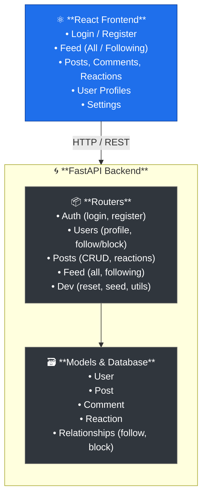

# 📋 Testbook Project Information

## Overview

Testbook is a fully functional fake social media application built specifically for QA automation testing practice. It provides a realistic testing environment with all the features you'd expect from a social media platform, without the complexity of a production application.

## Key Features

### For Testers

✅ **Test-friendly design** - All elements have `data-testid` attributes
✅ **Dev API endpoints** - Reset, seed, and manipulate test data easily
✅ **Predictable behavior** - Consistent, reproducible test scenarios
✅ **Comprehensive documentation** - Testing guides and examples included
✅ **Multiple testing approaches** - API, UI, E2E testing support

### For Learning

✅ **Realistic scenarios** - Real-world features to test
✅ **Modern tech stack** - Learn current frameworks
✅ **Best practices** - Clean code, proper architecture
✅ **Full-stack** - Practice both frontend and backend testing
✅ **Easy setup** - Running in minutes with Docker

## Technical Stack

### Backend

- **FastAPI** (Python 3.13) - Fast, modern API framework
- **SQLAlchemy** - SQL toolkit and ORM
- **SQLite** - Lightweight database
- **JWT** - Secure authentication
- **Pydantic** - Data validation
- **Uvicorn** - ASGI server

### Frontend

- **React 18** - UI library
- **Vite** - Build tool (fast!)
- **React Router** - Client-side routing
- **Axios** - HTTP client
- **CSS3** - Modern styling with custom properties

### DevOps

- **[Docker](https://www.docker.com/)** - Containerization for easy deployment
- **[Docker Compose](https://docs.docker.com/compose/)** - Multi-container orchestration
- **Pillow** - Image generation for test data

## Architecture



## File Structure

```text
Testbook/
├── backend/
│   ├── main.py              # FastAPI app entry
│   ├── database.py          # DB configuration
│   ├── models.py            # SQLAlchemy models
│   ├── schemas.py           # Pydantic schemas
│   ├── auth.py              # JWT authentication
│   ├── seed.py              # Database seeding
│   ├── requirements.txt     # Python dependencies
│   ├── routers/
│   │   ├── auth.py          # Authentication endpoints
│   │   ├── users.py         # User management
│   │   ├── posts.py         # Post operations
│   │   ├── feed.py          # Feed generation
│   │   └── dev.py           # Testing utilities
│   └── static/              # Images and media
│
├── frontend/
│   ├── src/
│   │   ├── App.jsx          # Main app component
│   │   ├── AuthContext.jsx # Auth state management
│   │   ├── api.js           # API client
│   │   ├── pages/
│   │   │   ├── Login.jsx    # Login page
│   │   │   ├── Register.jsx # Registration
│   │   │   ├── Feed.jsx     # Main feed
│   │   │   ├── PostDetail.jsx # Post details
│   │   │   ├── Profile.jsx  # User profile
│   │   │   └── Settings.jsx # User settings
│   │   └── components/
│   │       ├── Navbar.jsx   # Navigation bar
│   │       ├── Post.jsx     # Post component
│   │       ├── Comment.jsx  # Comment component
│   │       └── CreatePost.jsx # Post creation
│   ├── package.json
│   └── vite.config.js
│
├── Dockerfile               # Container build
├── docker-compose.yml       # Container orchestration
├── setup_images.py          # Generate test images
├── start.sh                 # Quick start script
├── start-dev.sh             # Dev mode script
│
├── README.md                # Main documentation
├── README.md#quick-start  # Quick setup guide
├── TESTING_GUIDE.md         # Testing examples
└── PROJECT_INFO.md          # This file
```

## Database Schema

### Users Table

```sql
- id (PK)
- email (unique)
- username (unique)
- display_name
- hashed_password
- bio
- profile_picture
- theme (light/dark)
- text_density (compact/normal)
- created_at
```

### Posts Table

```sql
- id (PK)
- author_id (FK → users.id)
- content
- image_url
- video_url
- is_repost (boolean)
- original_post_id (FK → posts.id)
- created_at
```

### Comments Table

```sql
- id (PK)
- post_id (FK → posts.id)
- author_id (FK → users.id)
- content
- created_at
```

### Reactions Table

```sql
- id (PK)
- post_id (FK → posts.id)
- user_id (FK → users.id)
- reaction_type (like, love, haha, wow, sad, angry)
- created_at
```

### Relationships (Many-to-Many)

```sql
followers:
- follower_id (FK → users.id)
- followed_id (FK → users.id)

blocks:
- blocker_id (FK → users.id)
- blocked_id (FK → users.id)
```

## API Endpoints

### Authentication

- `POST /api/auth/register` - Create new account
- `POST /api/auth/login` - Login (returns JWT)
- `GET /api/auth/me` - Get current user

### Users

- `GET /api/users/{username}` - User profile
- `GET /api/users/{username}/followers` - Get followers list
- `GET /api/users/{username}/following` - Get following list
- `PUT /api/users/me` - Update profile
- `POST /api/users/me/upload-avatar` - Upload profile picture
- `DELETE /api/users/me` - Delete account
- `POST /api/users/{username}/follow` - Follow
- `DELETE /api/users/{username}/follow` - Unfollow
- `POST /api/users/{username}/block` - Block
- `DELETE /api/users/{username}/block` - Unblock

### Posts

- `POST /api/posts/` - Create post
- `POST /api/posts/upload` - Upload media file
- `PUT /api/posts/{id}` - Update post
- `GET /api/posts/{id}` - Get post details
- `DELETE /api/posts/{id}` - Delete post
- `POST /api/posts/repost` - Create repost
- `DELETE /api/posts/repost/{id}` - Remove repost
- `POST /api/posts/{id}/comments` - Add comment
- `POST /api/posts/{id}/reactions` - Add reaction
- `DELETE /api/posts/{id}/reactions` - Remove reaction

### Feed

- `GET /api/feed/all` - All posts
- `GET /api/feed/following` - Following feed

### Dev/Testing

- `POST /api/dev/reset` - Reset database
- `POST /api/dev/seed` - Reseed data
- `GET /api/dev/users` - Get test users
- `POST /api/dev/create-post` - Create test post

## Testing Capabilities

### What Can You Test?

✅ **Authentication & Authorization**

- Login/logout flows
- Registration validation
- JWT token handling
- Protected route access

✅ **User Management**

- Profile creation/updates
- Follow/unfollow functionality
- Block/unblock behavior
- Account deletion

✅ **Content Management**

- Post creation (text, images, videos)
- File upload with drag-and-drop
- Post editing
- Post deletion
- Comment functionality
- Reaction system
- Repost feature

✅ **Feed & Filtering**

- "See All" vs "Following" feeds
- Blocked user filtering
- Post ordering
- Real-time updates

✅ **UI/UX**

- Theme switching (dark/light)
- Text density preferences
- Responsive design
- Navigation
- Form validation

✅ **API Testing**

- Request/response validation
- Error handling
- Status codes
- Data persistence

## Use Cases

### For QA Engineers

- Practice test automation frameworks ([Selenium](https://www.selenium.dev/), [Playwright](https://playwright.dev/), [Cypress](https://www.cypress.io/))
- Learn API testing ([Postman](https://www.postman.com/), [REST Assured](https://rest-assured.io/))
- Implement test strategies (smoke, regression, E2E)
- Practice writing test cases
- Learn CI/CD integration ([GitHub Actions](https://github.com/features/actions), [Jenkins](https://www.jenkins.io/))

### For Developers

- Practice full-stack development
- Learn modern frameworks
- Understand authentication flows
- Practice with ORMs and databases
- Learn containerization

### For Students

- Learn web development
- Understand REST APIs
- Practice with React
- Learn testing concepts
- Portfolio project

## Limitations (By Design)

⚠️ **Learning-focused** - Optimized for testing practice, not production deployment
⚠️ **Default to SQLite** - PostgreSQL supported via `DATABASE_URL` env var
⚠️ **No real-time updates** - Requires page refresh
⚠️ **No pagination** - Limited to 50 posts
⚠️ **Default secrets** - Warns if SECRET_KEY not set in environment

These are intentional simplifications to keep the focus on testing practice.

## Performance

- **Startup time:** ~5 seconds (Docker)
- **Container size:** ~500MB
- **Database size:** ~1MB (seeded)
- **API response:** <100ms (local)
- **Page load:** <1s (local)

## Security Notes

⚠️ **For Testing/Learning** - Additional hardening needed for production!

**Current Security Features:**

- ✅ JWT authentication with bcrypt password hashing
- ✅ Rate limiting (environment-aware: 100/min prod, 1000/min test)
- ✅ SECRET_KEY environment variable support with warnings
- ✅ Dev endpoints gated behind TESTING mode
- ✅ Authorization checks on user-owned resources

**What's Missing for Production:**

- ⚠️ No HTTPS enforcement (configure your reverse proxy)
- ⚠️ No CSRF protection (stateless API design)
- ⚠️ Default secrets used if env vars not set (warnings provided)

These limitations are acceptable for a learning platform.

## Future Enhancements (Optional)

Ideas for extending Testbook:

- Direct messaging
- Notifications
- Hashtags
- Search functionality
- Real-time updates (WebSockets)
- More reaction types
- Nested comments
- Post scheduling
- Pagination for large feeds

## Contributing

This is a testing practice tool, but contributions are welcome!

Ideas:

- Add more test scenarios
- Improve documentation
- Add example test suites
- Create video tutorials
- Add more seed data variations

## License

MIT License - Use freely for learning and testing!

## Support

For questions or issues:

1. Check [README.md](../../README.md)
2. Check [TESTING_GUIDE.md](../guides/TESTING_GUIDE.md)
3. Review API docs at `/docs`
4. Open an issue on GitHub

---

## 📚 More Resources

- **[README.md](../../README.md)** - Main documentation and project overview
- **[README.md](../../README.md#quick-start)** - Get started in 5 minutes
- **[TESTING_GUIDE.md](../guides/TESTING_GUIDE.md)** - Complete testing examples
- **[TESTING_PATTERNS.md](../concepts/TESTING_PATTERNS.md)** - Testing dynamic content patterns
- **[TESTING_CHEATSHEET.md](TESTING_CHEATSHEET.md)** - Quick reference guide
- **[TESTING_FEATURES.md](TESTING_FEATURES.md)** - All testable features

---

**Built for testers, by developers who care about quality! 🚀**
