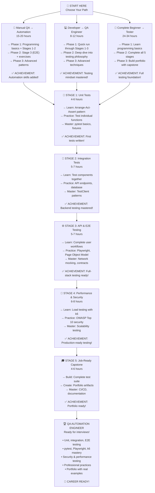
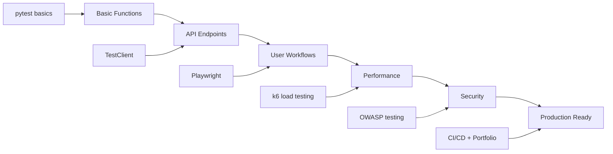

# 🎓 Testbook Learning Path

**A structured, self-guided journey to master automation testing**

Welcome! This learning path transforms the Testbook project into your personal testing bootcamp. Choose your learning style and build real-world automation testing skills that employers are actively seeking.

---

<h2 id="learning-approach">🎯 Learning Approach</h2>

**Structured curriculum** - Theory + hands-on labs with detailed instruction

- Complete testing fundamentals with theory
- Step-by-step hands-on labs
- Practice projects and self-assessments
- Professional testing practices and CI/CD
- Links to actual test files in the codebase
- Explains what to look for and why it matters
- Provides reflection questions to deepen understanding
- Builds toward portfolio-ready artifacts

**Duration:** 24-34 hours (core content) + 14-23 hours (optional exercises)

---

<h2 id="before-you-start">Before You Start: Where Are You Actually Starting From?</h2>

Answer these honestly before picking a track. There's no wrong answer here — the point is routing yourself to the right starting point instead of discovering you're in over your head partway through Stage 2.

1. **Have you written and run a function in Python or JavaScript before** — not copied one, actually written and run it yourself?
2. **Do you know what a terminal/command line is and can you `cd` into a directory and run a command?**
3. **Do you understand what an HTTP request is** — that a browser or app sends a request to a server and gets a response back with a status code?
4. **Have you used Git before** — at least `clone`, `commit`, and `push`?
5. **Have you ever manually tested software** — clicked through an app checking that things work, even without calling it "QA"?
6. **Do you know what a bug report or test case looks like**, even if you've never written one yourself?
7. **Have you ever written an automated test of any kind before** — in any language, any framework?

**Mostly no (1-2 yeses):** Learn a language before Stage 1 - trying to pick up programming syntax and testing concepts at the same time is harder than either alone. Which language depends on where you're headed: if you don't have a strong preference yet, start with Python - the ["Deciding based on your actual goal" section](#choose-your-track) below explains why it's the gentler on-ramp (synchronous by default, no `async`/`await` to learn on top of everything else). [learnpython.org](https://www.learnpython.org/) is a reasonable starting point. If you already know you want the JavaScript track (you're aiming at frontend/product-company roles, or you just prefer JS), [javascript.info](https://javascript.info/) covers the same ground for JavaScript. Either way, once you're comfortable writing and running a plain function, come back and start the [Manual QA Transition track](#choose-your-track) below, which paces "learning to code" and "learning to test" separately.

**Mostly yes but "no" on #7:** You're in the right place. Stage 1 assumes exactly this — comfortable with basic programming, new to testing. Don't skip ahead to Stage 2 no matter how easy Stage 1 looks; the fixture and mocking concepts in later labs build on Stage 1's foundation.

**Yes to everything, including #7:** You can move faster than the hour estimates suggest, but how much faster depends on what "written an automated test before" actually meant for you. If that was a handful of tests in a bootcamp or one prior job, skim each stage's README for the concepts you don't already know, jump straight to the labs, and use the reflection questions as a checkpoint rather than reading every explanation in full. If you're already comfortable with your chosen language's testing framework specifically - you can write a fixture or a mock without looking it up - Stage 1 will mostly teach you Testbook's own conventions rather than new testing concepts. Skim its README for what's Testbook-specific (the seed data, the API contracts the later stages assume), do Lab 1 to confirm the app and tooling work on your machine, and consider starting the real work at [Stage 2](stage_2_integration/) instead.

---

<h2 id="choose-your-track">Choose Your Track</h2>

| Path | Language Focus | Tools You'll Master | Time | Start Here |
| --- | --- | --- | --- | --- |
| **Python Track** | Python | pytest, Playwright Python, k6 | 24-34 hours | [Stage 1](stage_1_unit/) |
| **JavaScript Track** | JavaScript | Vitest, Playwright JS, MSW | 26-36 hours | [Lab 1](stage_1_unit/exercises/LAB_01_Your_First_Test_JavaScript.md) then [Stage 1](stage_1_unit/) |
| **Hybrid Track** | Python + JavaScript | All tools from both stacks | 28-38 hours | [Stage 1](stage_1_unit/) |
| **Manual QA Transition** | Python-first | pytest, Playwright, automation mindset | 32-42 hours | [Manual QA Guide](../docs/guides/MANUAL_QA_TO_AUTOMATION.md) |

That table tells you what you'll build. It doesn't tell you which one to pick if you have no strong opinion yet, so here's the actual reasoning.

### What each language is for in test automation specifically

Python's role in testing didn't come from Python being a good general-purpose language — it came from pytest becoming the default way to test anything with a Python backend, and from Python being the path of least resistance for people who aren't primarily software engineers (manual QA, data analysts, SDETs embedded on a backend team). If the system under test exposes an API, Python testing usually means: call the API, assert on the response, maybe drive a browser with Playwright for the parts a human still needs to see. It's rarely used to test frontend component internals, because there's no Python frontend to test against.

JavaScript's role is different because it's not optional the way Python is: if the frontend is React, Vue, or Angular, someone has to write tests in JavaScript or TypeScript to exercise components in isolation (Vitest, Jest, Testing Library), because there is no equivalent way to unit-test a React component from Python. Playwright and Cypress have also made JavaScript the more common choice for browser-based E2E testing specifically, even on teams whose backend is Python — the E2E test runner ends up living next to the frontend code either way.

Testbook's E2E suite exists in both languages side by side (`tests/e2e/` and `tests/e2e-python/`) precisely so you can see that neither is doing something the other structurally can't — it's the same Playwright API with different syntax on top. What Python can't do is test a React component's rendered output; what JavaScript testing here doesn't cover is anything below the HTTP boundary on the backend, where pytest exercises the database and business logic directly.

### The job market, honestly

QA/SDET job postings that name a language skew Python more often than not, largely because Python is the common denominator across backend-testing, data-adjacent, and manual-QA-to-automation roles, and because Selenium/pytest/Robot Framework have a long institutional head start. JavaScript-first testing roles cluster more tightly around frontend-heavy product companies, where the test authors are often the same engineers who wrote the component being tested, rather than a dedicated QA function. Neither of those patterns is universal, and plenty of job postings ask for "test automation experience" without naming a language at all — in practice, most mid-size and large engineering orgs will teach you their specific stack once you're hired, so the language on your resume matters less than being able to demonstrate you can design and debug a test suite in general. Don't over-optimize your track choice around a specific job posting you saw once; optimize it around the stack you're most likely to be productive in quickly.

### Learning curve from zero

If you've never programmed at all, Python is the gentler on-ramp: synchronous by default, fewer ways to shoot yourself in the foot with callbacks or promises, and `assert x == y` reads exactly like what it does. JavaScript testing requires you to understand `async`/`await` and promises almost immediately, because Playwright and Testing Library are asynchronous APIs — that's a real concept to learn, not just different syntax, and it trips up beginners more than anything Python-side does. If you already know JavaScript from frontend work, that cost is already paid and the JavaScript track will feel faster than switching to Python. If you already know Python, the reverse is true.

### Deciding based on your actual goal

- **You want the fastest path to any QA automation job:** start with Python. It's the safer default across the widest range of postings and the lower cognitive load lets you focus on testing concepts instead of language mechanics.
- **You're already a frontend developer, or the job you want is at a product company where engineers own their own tests:** start with JavaScript — you'll be testing the kind of code you already write, and skipping it means learning async testing patterns later under time pressure instead of now.
- **You want to be the person who can test anything handed to you, backend or frontend:** do the Hybrid track. It costs more hours up front but it's the most accurate simulation of what a full-stack QA role actually asks of you.
- **You're transitioning from manual QA and have never written code:** use the Manual QA Transition track. It's Python-first for the reasons above, and it paces the "learning to code" and "learning to test" problems separately instead of forcing you to solve both at once.

If none of that resolves it for you, default to the Hybrid track — it's strictly a superset of the other two, just longer.

---

<h2 id="testing-pyramid">🏗️ The Testing Pyramid</h2>

Both Python and JavaScript tracks follow the same testing pyramid, but with different tools:

```text
                ▲
               /_\  ← Manual / Exploratory Testing
              /   \
             / E2E \  ← Playwright (JS / Python)
            /_______\
           /         \
          / Component \  ← Vitest + RTL (JS only)
         /_____________\
        /               \
       /  Integration    \  ← API / Component tests
      /___________________\
     /                     \
    /      Unit Tests       \  ← Vitest (JS) | pytest (Python)
   /_________________________\
```

**Python Track:**

- **Unit:** pytest (backend functions)
- **Integration:** pytest + TestClient (API endpoints)
- **E2E:** Playwright Python (complete user flows)

**JavaScript Track:**

- **Unit:** Vitest (frontend utilities)
- **Component:** Vitest + React Testing Library (React components)
- **Integration:** Vitest + MSW (API mocking)
- **E2E:** Playwright JavaScript (complete user flows)

**Both tracks teach the same concepts** - choose based on your comfort level!

---

<h2 id="visual-learning-journey">📊 Visual Learning Journey</h2>


```mermaid
flowchart TD
    A["🎯 START HERE<br/>Choose Your Path"]
    A --> B["🔄 Manual QA → Automation<br/>15-20 hours<br/><br/>→ Phase 1: Programming basics + Stages 1-2<br/>→ Phase 2: Stage 3 (E2E) + exercises<br/>→ Phase 3: Advanced patterns<br/><br/>✅ ACHIEVEMENT: Automation skills added!"]
    A --> C["💻 Developer → QA Engineer<br/>8-12 hours<br/><br/>→ Phase 1: Quick run through Stages 1-3<br/>→ Phase 2: Deep dive into testing philosophy<br/>→ Phase 3: Advanced techniques<br/><br/>✅ ACHIEVEMENT: Testing mindset mastered!"]
    A --> D["🌱 Complete Beginner → Tester<br/>24-34 hours<br/><br/>→ Phase 1: Learn programming basics<br/>→ Phase 2: Complete all 5 stages<br/>→ Phase 3: Build portfolio with capstone<br/><br/>✅ ACHIEVEMENT: Full testing foundation!"]

    B --> E["🧪 STAGE 1: Unit Tests<br/>4-6 hours<br/><br/>→ Learn: Arrange-Act-Assert pattern<br/>→ Practice: Test individual functions<br/>→ Master: pytest basics, fixtures<br/><br/>✅ ACHIEVEMENT: First tests written!"]
    C --> E
    D --> E

    E --> F["🧱 STAGE 2: Integration Tests<br/>5-7 hours<br/><br/>→ Learn: Test components together<br/>→ Practice: API endpoints, database<br/>→ Master: TestClient patterns<br/><br/>✅ ACHIEVEMENT: Backend testing mastered!"]

    F --> G["🌐 STAGE 3: API & E2E Testing<br/>5-7 hours<br/><br/>→ Learn: Complete user workflows<br/>→ Practice: Playwright, Page Object Model<br/>→ Master: Network mocking, contracts<br/><br/>✅ ACHIEVEMENT: Full-stack testing ready!"]

    G --> H["🚀 STAGE 4: Performance & Security<br/>6-8 hours<br/><br/>→ Learn: Load testing with k6<br/>→ Practice: OWASP Top 10 security<br/>→ Master: Scalability testing<br/><br/>✅ ACHIEVEMENT: Production-ready testing!"]

    H --> I["🎓 STAGE 5: Job-Ready Capstone<br/>4-6 hours<br/><br/>→ Build: Complete test suite<br/>→ Create: Portfolio artifacts<br/>→ Master: CI/CD, documentation<br/><br/>✅ ACHIEVEMENT: Portfolio ready!"]

    I --> J["🏆 QA AUTOMATION ENGINEER<br/>Ready for interviews!<br/><br/>• Unit, integration, E2E testing<br/>• pytest, Playwright, k6 mastery<br/>• Security & performance testing<br/>• Professional practices<br/>• Portfolio with real examples<br/><br/>🎯 CAREER READY!"]
```

---

<h2 id="choose-your-learning-path">🎯 Choose Your Learning Path</h2>

**Select the path that matches your background and goals**

### Path 1: **Manual QA → Automation** 🔄

**You are:** Experienced manual tester wanting to add automation skills

**Your Journey:**

- **Phase 1:** Programming basics (Python recommended) + Stage 1-2
- **Phase 2:** Stage 3 (E2E testing) + exercises
- **Phase 3:** Advanced patterns from [docs/advanced/](../docs/advanced/)

**Time:** 15-20 hours (plus programming basics if needed)

**Key Resources:**

- [Testing Philosophy](../docs/concepts/TESTING_PHILOSOPHY.md) - Why testing matters
- [Testing Anti-Patterns](../docs/concepts/TESTING_ANTIPATTERNS.md) - Common mistakes to avoid

---

### Path 2: **Developer → QA Engineer** 💻

**You are:** Software engineer adding testing skills to your toolkit

**Your Journey:**

- **Phase 1:** Quick run through Stages 1-3 (focus on testing mindset)
- **Phase 2:** Deep dive into [docs/concepts/](../docs/concepts/) for testing philosophy
- **Phase 3:** Advanced techniques from [docs/advanced/](../docs/advanced/)

**Time:** 8-12 hours

**Key Resources:**

- [Case Studies](../docs/industry/CASE_STUDIES.md) - Real incidents and what's genuinely documented about industry practice
- [Tool Comparison](../docs/industry/TOOL_COMPARISON.md) - When to use what

---

### Path 3: **Complete Beginner → Tester** 🌱

**You are:** New to both programming and testing

**Your Journey:**

- **Phase 1:** Learn programming basics (Python or JavaScript)
- **Phase 2:** Complete all 5 stages at your own pace
- **Phase 3:** Build portfolio with Stage 5 capstone

**Time:** 24-34 hours (including programming basics)

**Key Resources:**

- [Career Guide](../docs/industry/CAREER_GUIDE.md) - QA career paths and salaries
- [Case Studies](../docs/industry/CASE_STUDIES.md) - Real-world testing stories

---

<h2 id="the-5-stages">📊 The 5 Stages</h2>

### 🧪 Stage 1: Unit Tests

**Duration:** 4-6 hours (core content) + 2-3 hours (optional exercises)
**What you'll learn:** Test individual functions in isolation

**Core Content:** Theory + hands-on labs covering Arrange-Act-Assert pattern, parameterized tests, coverage analysis
**Optional Exercises:** Explore existing unit tests, understand fixtures and mocking

👉 [Start Stage 1](stage_1_unit/README.md)

---

### 🧱 Stage 2: Integration Tests

**Duration:** 5-7 hours (core content) + 3-5 hours (optional exercises)
**What you'll learn:** Test how components work together

**Core Content:** Theory + hands-on labs covering HTTP testing, database fixtures, complete user journeys
**Optional Exercises:** Examine API endpoint tests, understand TestClient patterns

👉 [Start Stage 2](stage_2_integration/README.md)

---

### 🌐 Stage 3: API & E2E Testing

**Duration:** 5-7 hours (core content) + 3-5 hours (optional exercises)
**What you'll learn:** Test complete user workflows and contracts

**Core Content:** Theory + hands-on labs covering component testing, E2E patterns, Page Object Model, network mocking
**Optional Exercises:** Run Playwright tests, understand page interactions

👉 [Start Stage 3](stage_3_api_e2e/README.md)

---

### 🚀 Stage 4: Performance & Security

**Duration:** 6-8 hours (core content) + 4-6 hours (optional exercises)
**What you'll learn:** Test scalability and protect against vulnerabilities

**Core Content:** Theory + hands-on labs covering load testing, OWASP Top 10, API testing, contract validation
**Optional Exercises:** Run performance tests with k6, understand security testing basics

👉 [Start Stage 4](stage_4_performance_security/README.md)

---

### 🎓 Stage 5: Job-Ready Capstone

**Duration:** 4-6 hours (core content) + 2-4 hours (optional exercises)
**What you'll build:** Portfolio-ready test suite + documentation

**Core Content:** CI/CD setup, professional practices, complete project with full test coverage
**Optional Exercises:** Build a feature with test coverage, create portfolio artifacts

👉 [Start Stage 5](stage_5_capstone/README.md)

---

<h2 id="learning-outcomes">🎯 Learning Outcomes</h2>

By completing all 5 stages, you will be able to:

✅ Write unit, integration, and E2E tests professionally
✅ Use pytest, Playwright, and k6 effectively
✅ Test APIs, UIs, databases, and security
✅ Build test automation frameworks from scratch
✅ Present your work confidently in interviews
✅ Understand QA engineering workflows

---

<h2 id="prerequisites">📋 Prerequisites</h2>

Before starting Stage 1:

- ✅ Testbook installed and running ([Quick Start Guide](../README.md#quick-start))
- ✅ Basic Python knowledge (functions, classes, imports)
- ✅ Basic JavaScript knowledge (optional for E2E)
- ✅ Terminal/command line familiarity
- ✅ Code editor (VS Code recommended)

---

## 🏁 Getting Started

### Quick Start

```bash
# 1. Ensure Testbook is running
cd testbook
./start-dev.sh  # macOS/Linux
start-dev.bat   # Windows

# 2. Verify it's working
# Open http://localhost:3000

# 3. Start learning!
# Open learn/stage_1_unit/README.md
```

### Your Learning Journey

1. **Read** the stage README to understand goals
2. **Explore** the linked test files (don't just skim!)
3. **Run** the tests and observe the output
4. **Experiment** by modifying tests
5. **Reflect** using the reflection questions
6. **Move forward** when you feel confident

---

## 💡 How to Use This Path

### ✅ DO

- **Go in order** - Each stage builds on previous knowledge
- **Type code yourself** - Don't copy-paste; typing builds muscle memory
- **Break things** - Modify tests, see what fails, fix them
- **Take notes** - Document "aha!" moments
- **Ask "why?"** - Understand the reasoning behind patterns
- **Reflect deeply** - Answer reflection questions thoughtfully

### ❌ DON'T

- Skip stages or rush through
- Just read code without running it
- Ignore failing tests
- Move forward if confused
- Copy-paste without understanding

---

<h2 id="track-your-progress">🎖️ Track Your Progress</h2>

As you complete stages, mark your achievements:

- [ ] 🧪 **Stage 1 Complete** - Unit Testing Foundations
- [ ] 🧱 **Stage 2 Complete** - Integration Testing Mastery
- [ ] 🌐 **Stage 3 Complete** - API & E2E Testing Pro
- [ ] 🚀 **Stage 4 Complete** - Performance & Security Expert
- [ ] 🎓 **Stage 5 Complete** - Portfolio Ready!

**Completion Milestones:**

- **3 stages done?** You can start applying for junior QA roles!
- **4 stages done?** You're competitive for mid-level positions
- **5 stages done?** You have senior-level testing knowledge

---

<h2 id="relationship-to-labs">🔄 Relationship to Labs</h2>

**What's the difference between `/learn/` and the old `/labs/`?**

| Path                      | Purpose               | Structure                | Best For                   |
| ------------------------- | --------------------- | ------------------------ | -------------------------- |
| **`/learn/`**             | Structured curriculum | Sequential stages        | Self-guided mastery        |
| **`/learn/*/exercises/`** | Hands-on exercises    | Stage-specific workshops | Practicing specific skills |

**Use the new structure:**

1. Follow `/learn/` stages for overall progression
2. Use `/learn/*/exercises/` to practice specific concepts within each stage
3. Come back to `/learn/` to see how it all connects

---

<h2 id="getting-help">📞 Getting Help</h2>

**Stuck or confused?**

1. **Re-read the stage README** - It might click the second time
2. **Check the test output** - Error messages are clues
3. **Review reflection questions** - They guide your thinking
4. **Explore related labs** - More hands-on practice
5. **Check documentation:**
   - [Troubleshooting Guide](../docs/reference/TROUBLESHOOTING.md) - Technical errors with exact fixes
   - [FAQ](../docs/guides/FAQ.md) - Learning questions and quick setup guidance
   - [Glossary](../docs/reference/GLOSSARY.md) - Unfamiliar term? Check here first
   - [Testing Guide](../docs/guides/TESTING_GUIDE.md)
   - [Running Tests](../docs/guides/RUNNING_TESTS.md)

---

<h2 id="ready-to-begin">🚀 Ready to Begin?</h2>

### 👉 [Start Stage 1: Unit Tests](stage_1_unit/README.md)

**Your testing journey starts now. Let's build skills that matter! 🎯**

---

<h2 id="detailed-curriculum">📚 Detailed Curriculum Breakdown</h2>

### 🎯 Recommended Path for Beginners

**Start here if you're new to testing!**

1. **Week 1:** Complete Stage 1 (Unit Testing)
2. **Week 2:** Complete Stage 2 (Integration Testing)
3. **Week 3:** Complete Stage 3 (E2E Testing)
4. **Week 4:** Complete Stage 4 (Performance & Security)
5. **Week 5:** Complete Stage 5 (Portfolio Capstone)

**Total time:** 24-34 hours over 5 weeks

### 📊 Skill Progression


```mermaid
graph LR
    A[Basic Functions] --> B[API Endpoints]
    B --> C[User Workflows]
    C --> D[Performance]
    D --> E[Security]
    E --> F[Production Ready]

    A1[pytest basics] --> A
    B1[TestClient] --> B
    C1[Playwright] --> C
    D1[k6 load testing] --> D
    E1[OWASP testing] --> E
    F1[CI/CD + Portfolio] --> F
```

### 🧪 Stage-by-Stage Breakdown

#### Stage 1: Unit Testing (4-6 hours)

- **Lab 1:** Your First Test (Python/JavaScript)
- **Lab 2:** Testing Real Functions (Python/JavaScript)
- **Lab 3:** Fixtures and Test Data (Python/JavaScript)
- **Lab 4:** Debugging and Error Handling (Python/JavaScript)

#### Stage 2: Integration Testing (5-7 hours)

- **Lab 5:** API Endpoint Testing (Python/JavaScript)
- **Lab 6:** Component Testing (JavaScript) / Advanced API Testing (Python)
- **Lab 7:** Test Data Management (Python/JavaScript)
- **Lab 8:** Contract Testing Foundations (Python/JavaScript)

#### Stage 3: E2E Testing (5-7 hours)

- **Lab 9:** Basic E2E Testing (Python/JavaScript)
- **Lab 10:** Advanced E2E Patterns (Python/JavaScript)
- **Lab 11:** Cross-Browser Testing (Python/JavaScript)
- **Lab 12:** E2E Test Organization (Python/JavaScript)

#### Stage 4: Performance & Security (6-8 hours)

- **Lab 13:** Load Testing with k6
- **Lab 14:** Security Testing OWASP (Python/JavaScript)
- **Lab 15:** Rate Limiting Testing (Python/JavaScript)

#### Stage 5: Portfolio Capstone (4-6 hours)

- Design a test plan and build a complete test suite for a feature (Python and/or JavaScript track)
- Produce portfolio artifacts: coverage reports, E2E recordings, and testing documentation

Stage 5 is project-based rather than lab-based - see [Stage 5](stage_5_capstone/README.md) for the full walkthrough.

---

## 📈 What Happens After?

After finishing Stage 5's reflection, read [COMPLETION.md](COMPLETION.md) for a wrap-up of the full path and pointers to what to learn next.

After completing all 5 stages:

1. **Build your portfolio** with artifacts from Stage 5
2. **Contribute to Testbook** - Add tests, fix bugs, improve docs
3. **Share your journey** - Blog posts, LinkedIn updates
4. **Help others** - Answer questions, mentor newcomers
5. **Keep practicing** - Testing is a skill that grows with use

---

_Last updated: October 2025 | Testbook v1.3_
