```mermaid
flowchart TD
    A["🎯 START HERE<br/>Choose Your Path"]
    A --> B["🔄 Manual QA → Automation<br/>15-20 hours<br/><br/>→ Phase 1: Programming basics + Stages 1-2<br/>→ Phase 2: Stage 3 (E2E) + exercises<br/>→ Phase 3: Advanced patterns<br/><br/>✅ ACHIEVEMENT: Automation skills added!"]
    A --> C["💻 Developer → QA Engineer<br/>8-12 hours<br/><br/>→ Phase 1: Quick run through Stages 1-3<br/>→ Phase 2: Deep dive into testing philosophy<br/>→ Phase 3: Advanced techniques<br/><br/>✅ ACHIEVEMENT: Testing mindset mastered!"]
    A --> D["🌱 Complete Beginner → Tester<br/>20-30 hours<br/><br/>→ Phase 1: Learn programming basics<br/>→ Phase 2: Complete all 5 stages<br/>→ Phase 3: Build portfolio with capstone<br/><br/>✅ ACHIEVEMENT: Full testing foundation!"]

    B --> E["🧪 STAGE 1: Unit Tests<br/>4-6 hours<br/><br/>→ Learn: Arrange-Act-Assert pattern<br/>→ Practice: Test individual functions<br/>→ Master: pytest basics, fixtures<br/><br/>✅ ACHIEVEMENT: First tests written!"]
    C --> E
    D --> E

    E --> F["🧱 STAGE 2: Integration Tests<br/>5-7 hours<br/><br/>→ Learn: Test components together<br/>→ Practice: API endpoints, database<br/>→ Master: TestClient patterns<br/><br/>✅ ACHIEVEMENT: Backend testing mastered!"]

    F --> G["🌐 STAGE 3: API & E2E Testing<br/>5-7 hours<br/><br/>→ Learn: Complete user workflows<br/>→ Practice: Playwright, Page Object Model<br/>→ Master: Network mocking, contracts<br/><br/>✅ ACHIEVEMENT: Full-stack testing ready!"]

    G --> H["🚀 STAGE 4: Performance & Security<br/>6-8 hours<br/><br/>→ Learn: Load testing with k6<br/>→ Practice: OWASP Top 10 security<br/>→ Master: Scalability testing<br/><br/>✅ ACHIEVEMENT: Production-ready testing!"]

    H --> I["🎓 STAGE 5: Job-Ready Capstone<br/>4-6 hours<br/><br/>→ Build: Complete test suite<br/>→ Create: Portfolio artifacts<br/>→ Master: CI/CD, documentation<br/><br/>✅ ACHIEVEMENT: Portfolio ready!"]

    I --> J["🏆 QA AUTOMATION ENGINEER<br/>Ready for interviews!<br/><br/>• Unit, integration, E2E testing<br/>• pytest, Playwright, k6 mastery<br/>• Security & performance testing<br/>• Professional practices<br/>• Portfolio with real examples<br/><br/>🎯 CAREER READY!"]
```

# 🎓 Testbook Learning Path

**A structured, self-guided journey to master automation testing**

Welcome! This learning path transforms the Testbook project into your personal testing bootcamp. Choose your learning style and build real-world automation testing skills that employers are actively seeking.

---

<h2 id="learning-approach">🎯 Learning Approach</h2>

**Structured curriculum** - Theory + hands-on labs with detailed instruction

- Complete testing fundamentals with theory
- Step-by-step hands-on labs
- Practice projects and self-assessments
- Professional testing practices and CI/CD
- Links to actual test files in the codebase
- Explains what to look for and why it matters
- Provides reflection questions to deepen understanding
- Builds toward portfolio-ready artifacts

**Duration:** 24-34 hours (core content) + 14-20 hours (optional exercises)

---

<h2 id="choose-your-track">🎯 Choose Your Track</h2>

Pick the track that matches your background and goals:

| Path                        | Language Focus      | Tools You'll Master                    | Time        | Best For                         | Start Here                                                                                         |
| --------------------------- | ------------------- | -------------------------------------- | ----------- | -------------------------------- | -------------------------------------------------------------------------------------------------- |
| **🐍 Python Track**         | Python              | pytest, Playwright Python, k6          | 24-34 hours | Backend developers, API testing  | [Stage 1](stage_1_unit/)                                                                           |
| **🟨 JavaScript Track**     | JavaScript          | Vitest, Playwright JS, MSW             | 26-36 hours | Frontend developers, React teams | [Lab 1](stage_1_unit/exercises/LAB_01_Your_First_Test_JavaScript.md) then [Stage 1](stage_1_unit/) |
| **🔄 Hybrid Track**         | Python + JavaScript | All tools from both stacks             | 28-38 hours | Full-stack QA, most realistic    | [Stage 1](stage_1_unit/)                                                                           |
| **⚡ Manual QA Transition** | Python-first        | pytest, Playwright, automation mindset | 32-42 hours | Manual testers going automation  | [Manual QA Guide](../docs/guides/MANUAL_QA_TO_AUTOMATION.md)                                       |

**Not sure?** Try the [Hybrid Track](stage_1_unit/) - it's what most real QA roles need!

---

<h2 id="testing-pyramid">🏗️ The Testing Pyramid</h2>

Both Python and JavaScript tracks follow the same testing pyramid, but with different tools:

```text
                ▲
               /_\  ← Manual / Exploratory Testing
              /   \
             / E2E \  ← Playwright (JS / Python)
            /_______\
           /         \
          / Component \  ← Vitest + RTL (JS only)
         /_____________\
        /               \
       /  Integration    \  ← API / Component tests
      /___________________\
     /                     \
    /      Unit Tests       \  ← Vitest (JS) | pytest (Python)
   /_________________________\
```

**Python Track:**

- **Unit:** pytest (backend functions)
- **Integration:** pytest + TestClient (API endpoints)
- **E2E:** Playwright Python (complete user flows)

**JavaScript Track:**

- **Unit:** Vitest (frontend utilities)
- **Component:** Vitest + React Testing Library (React components)
- **Integration:** Vitest + MSW (API mocking)
- **E2E:** Playwright JavaScript (complete user flows)

**Both tracks teach the same concepts** - choose based on your comfort level!

---

<h2 id="visual-learning-journey">📊 Visual Learning Journey</h2>



---

<h2 id="choose-your-learning-path">🎯 Choose Your Learning Path</h2>

**Select the path that matches your background and goals**

### Path 1: **Manual QA → Automation** 🔄

**You are:** Experienced manual tester wanting to add automation skills

**Your Journey:**

- **Phase 1:** Programming basics (Python recommended) + Stage 1-2
- **Phase 2:** Stage 3 (E2E testing) + exercises
- **Phase 3:** Advanced patterns from [docs/advanced/](docs/advanced/)

**Time:** 15-20 hours (plus programming basics if needed)

**Key Resources:**

- [Testing Philosophy](docs/concepts/TESTING_PHILOSOPHY.md) - Why testing matters
- [Testing Anti-Patterns](docs/concepts/TESTING_ANTIPATTERNS.md) - Common mistakes to avoid

---

### Path 2: **Developer → QA Engineer** 💻

**You are:** Software engineer adding testing skills to your toolkit

**Your Journey:**

- **Phase 1:** Quick run through Stages 1-3 (focus on testing mindset)
- **Phase 2:** Deep dive into [docs/concepts/](docs/concepts/) for testing philosophy
- **Phase 3:** Advanced techniques from [docs/advanced/](docs/advanced/)

**Time:** 8-12 hours

**Key Resources:**

- [Industry Practices](docs/industry/INDUSTRY_PRACTICES.md) - How companies test
- [Tool Comparison](docs/industry/TOOL_COMPARISON.md) - When to use what

---

### Path 3: **Complete Beginner → Tester** 🌱

**You are:** New to both programming and testing

**Your Journey:**

- **Phase 1:** Learn programming basics (Python or JavaScript)
- **Phase 2:** Complete all 5 stages at your own pace
- **Phase 3:** Build portfolio with Stage 5 capstone

**Time:** 20-30 hours (including programming basics)

**Key Resources:**

- [Career Guide](docs/industry/CAREER_GUIDE.md) - QA career paths and salaries
- [Case Studies](docs/industry/CASE_STUDIES.md) - Real-world testing stories

---

<h2 id="the-5-stages">📊 The 5 Stages</h2>

### 🧪 Stage 1: Unit Tests

**Duration:** 4-6 hours (core content) + 2-3 hours (optional exercises)
**What you'll learn:** Test individual functions in isolation

**Core Content:** Theory + hands-on labs covering Arrange-Act-Assert pattern, parameterized tests, coverage analysis
**Optional Exercises:** Explore existing unit tests, understand fixtures and mocking

👉 [Start Stage 1](stage_1_unit/README.md)

---

### 🧱 Stage 2: Integration Tests

**Duration:** 5-7 hours (core content) + 3-5 hours (optional exercises)
**What you'll learn:** Test how components work together

**Core Content:** Theory + hands-on labs covering HTTP testing, database fixtures, complete user journeys
**Optional Exercises:** Examine API endpoint tests, understand TestClient patterns

👉 [Start Stage 2](stage_2_integration/README.md)

---

### 🌐 Stage 3: API & E2E Testing

**Duration:** 5-7 hours (core content) + 3-5 hours (optional exercises)
**What you'll learn:** Test complete user workflows and contracts

**Core Content:** Theory + hands-on labs covering component testing, E2E patterns, Page Object Model, network mocking
**Optional Exercises:** Run Playwright tests, understand page interactions

👉 [Start Stage 3](stage_3_api_e2e/README.md)

---

### 🚀 Stage 4: Performance & Security

**Duration:** 6-8 hours (core content) + 4-6 hours (optional exercises)
**What you'll learn:** Test scalability and protect against vulnerabilities

**Core Content:** Theory + hands-on labs covering load testing, OWASP Top 10, API testing, contract validation
**Optional Exercises:** Run performance tests with k6, understand security testing basics

👉 [Start Stage 4](stage_4_performance_security/README.md)

---

### 🎓 Stage 5: Job-Ready Capstone

**Duration:** 4-6 hours (core content) + 2-4 hours (optional exercises)
**What you'll build:** Portfolio-ready test suite + documentation

**Core Content:** CI/CD setup, professional practices, complete project with full test coverage
**Optional Exercises:** Build a feature with test coverage, create portfolio artifacts

👉 [Start Stage 5](stage_5_capstone/README.md)

---

<h2 id="learning-outcomes">🎯 Learning Outcomes</h2>

By completing all 5 stages, you will be able to:

✅ Write unit, integration, and E2E tests professionally
✅ Use pytest, Playwright, and k6 effectively
✅ Test APIs, UIs, databases, and security
✅ Build test automation frameworks from scratch
✅ Present your work confidently in interviews
✅ Understand QA engineering workflows

---

<h2 id="prerequisites">📋 Prerequisites</h2>

Before starting Stage 1:

- ✅ Testbook installed and running ([Quick Start Guide](../README.md#quick-start-5-minutes))
- ✅ Basic Python knowledge (functions, classes, imports)
- ✅ Basic JavaScript knowledge (optional for E2E)
- ✅ Terminal/command line familiarity
- ✅ Code editor (VS Code recommended)

---

## 🏁 Getting Started

### Quick Start

```bash
# 1. Ensure Testbook is running
cd testbook
./start-dev.sh  # macOS/Linux
start-dev.bat   # Windows

# 2. Verify it's working
# Open http://localhost:3000

# 3. Start learning!
# Open learn/stage_1_unit/README.md
```

### Your Learning Journey

1. **Read** the stage README to understand goals
2. **Explore** the linked test files (don't just skim!)
3. **Run** the tests and observe the output
4. **Experiment** by modifying tests
5. **Reflect** using the reflection questions
6. **Move forward** when you feel confident

---

## 💡 How to Use This Path

### ✅ DO

- **Go in order** - Each stage builds on previous knowledge
- **Type code yourself** - Don't copy-paste; typing builds muscle memory
- **Break things** - Modify tests, see what fails, fix them
- **Take notes** - Document "aha!" moments
- **Ask "why?"** - Understand the reasoning behind patterns
- **Reflect deeply** - Answer reflection questions thoughtfully

### ❌ DON'T

- Skip stages or rush through
- Just read code without running it
- Ignore failing tests
- Move forward if confused
- Copy-paste without understanding

---

<h2 id="track-your-progress">🎖️ Track Your Progress</h2>

As you complete stages, mark your achievements:

- [ ] 🧪 **Stage 1 Complete** - Unit Testing Foundations
- [ ] 🧱 **Stage 2 Complete** - Integration Testing Mastery
- [ ] 🌐 **Stage 3 Complete** - API & E2E Testing Pro
- [ ] 🚀 **Stage 4 Complete** - Performance & Security Expert
- [ ] 🎓 **Stage 5 Complete** - Portfolio Ready!

**Completion Milestones:**

- **3 stages done?** You can start applying for junior QA roles!
- **4 stages done?** You're competitive for mid-level positions
- **5 stages done?** You have senior-level testing knowledge

---

<h2 id="relationship-to-labs">🔄 Relationship to Labs</h2>

**What's the difference between `/learn/` and the old `/labs/`?**

| Path                      | Purpose               | Structure                | Best For                   |
| ------------------------- | --------------------- | ------------------------ | -------------------------- |
| **`/learn/`**             | Structured curriculum | Sequential stages        | Self-guided mastery        |
| **`/learn/*/exercises/`** | Hands-on exercises    | Stage-specific workshops | Practicing specific skills |

**Use the new structure:**

1. Follow `/learn/` stages for overall progression
2. Use `/learn/*/exercises/` to practice specific concepts within each stage
3. Come back to `/learn/` to see how it all connects

---

<h2 id="getting-help">📞 Getting Help</h2>

**Stuck or confused?**

1. **Re-read the stage README** - It might click the second time
2. **Check the test output** - Error messages are clues
3. **Review reflection questions** - They guide your thinking
4. **Explore related labs** - More hands-on practice
5. **Check documentation:**
   - [Troubleshooting Guide](../docs/reference/TROUBLESHOOTING.md) - Technical errors with exact fixes
   - [FAQ](../README.md#frequently-asked-questions) - Learning questions and quick setup guidance
   - [Testing Guide](../docs/guides/TESTING_GUIDE.md)
   - [Running Tests](../docs/guides/RUNNING_TESTS.md)

---

<h2 id="ready-to-begin">🚀 Ready to Begin?</h2>

### 👉 [Start Stage 1: Unit Tests](stage_1_unit/README.md)

**Your testing journey starts now. Let's build skills that matter! 🎯**

---

<h2 id="detailed-curriculum">📚 Detailed Curriculum Breakdown</h2>

### 🎯 Recommended Path for Beginners

**Start here if you're new to testing!**

1. **Week 1:** Complete Stage 1 (Unit Testing)
2. **Week 2:** Complete Stage 2 (Integration Testing)
3. **Week 3:** Complete Stage 3 (E2E Testing)
4. **Week 4:** Complete Stage 4 (Performance & Security)
5. **Week 5:** Complete Stage 5 (Portfolio Capstone)

**Total time:** 20-30 hours over 5 weeks

### 📊 Skill Progression


### 🧪 Stage-by-Stage Breakdown

#### Stage 1: Unit Testing (4-6 hours)

- **Lab 1:** Your First Test (Python/JavaScript)
- **Lab 2:** Testing Real Functions (Python/JavaScript)
- **Lab 3:** Fixtures and Test Data (Python/JavaScript)
- **Lab 4:** Debugging and Error Handling (Python/JavaScript)

#### Stage 2: Integration Testing (5-7 hours)

- **Lab 5:** API Endpoint Testing (Python/JavaScript)
- **Lab 6:** Component Testing (JavaScript only)
- **Lab 7:** Test Data Management (Python/JavaScript)
- **Lab 8:** Contract Testing Foundations (Python/JavaScript)

#### Stage 3: E2E Testing (5-7 hours)

- **Lab 9:** Basic E2E Testing (Python/JavaScript)
- **Lab 10:** Advanced E2E Patterns (Python/JavaScript)
- **Lab 11:** Cross-Browser Testing (Python/JavaScript)
- **Lab 12:** E2E Test Organization (Python/JavaScript)

#### Stage 4: Performance & Security (6-8 hours)

- **Lab 13:** Load Testing with k6
- **Lab 14:** Security Testing OWASP (Python/JavaScript)
- **Lab 15:** Rate Limiting Testing (Python/JavaScript)

#### Stage 5: Portfolio Capstone (4-6 hours)

- **Lab 16:** Complete Test Suite Design
- **Lab 17:** Portfolio Documentation

---

## 📈 What Happens After?

After completing all 5 stages:

1. **Build your portfolio** with artifacts from Stage 5
2. **Contribute to Testbook** - Add tests, fix bugs, improve docs
3. **Share your journey** - Blog posts, LinkedIn updates
4. **Help others** - Answer questions, mentor newcomers
5. **Keep practicing** - Testing is a skill that grows with use

---

_Last updated: October 2025 | Testbook v1.3_
