# 🎓 Testbook Learning Path

**A structured, self-guided journey to master automation testing**

Welcome! This learning path transforms the Testbook project into your personal testing bootcamp. Choose your learning style and build real-world automation testing skills that employers are actively seeking.

---

## 🗺️ Choose Your Learning Style

### ⚡ Quick Path (12-18 hours)

**Exploration-based learning** - Learn by examining real, working test code

- Links to actual test files in the codebase
- Explains what to look for and why it matters
- Provides reflection questions to deepen understanding
- Builds toward portfolio-ready artifacts

### 📚 Comprehensive Path (30-40 hours)

**Structured curriculum** - Theory + hands-on labs with detailed instruction

- Complete testing fundamentals with theory
- Step-by-step hands-on labs
- Practice projects and self-assessments
- Professional testing practices and CI/CD

**Both paths lead to the same outcome: Professional automation testing skills!**

---

## 🎯 Choose Your Track

Pick the track that matches your background and goals:

| Path                        | Language Focus      | Tools You'll Master                    | Time        | Best For                         | Start Here                                                                              |
| --------------------------- | ------------------- | -------------------------------------- | ----------- | -------------------------------- | --------------------------------------------------------------------------------------- |
| **🐍 Python Track**         | Python              | pytest, Playwright Python, k6          | 12-15 hours | Backend developers, API testing  | [Stage 1](stage_1_unit/)                                                                |
| **☕ JavaScript Track**     | JavaScript          | Vitest, Playwright JS, MSW             | 14-17 hours | Frontend developers, React teams | [Lab 1](stage_1_unit/exercises/LAB_01_Your_First_Test.md) then [Stage 1](stage_1_unit/) |
| **🔄 Hybrid Track**         | Python + JavaScript | All tools from both stacks             | 15-18 hours | Full-stack QA, most realistic    | [Stage 1](stage_1_unit/)                                                                |
| **⚡ Manual QA Transition** | Python-first        | pytest, Playwright, automation mindset | 20-25 hours | Manual testers going automation  | [Manual QA Guide](../docs/guides/MANUAL_QA_TO_AUTOMATION.md)                            |

**Not sure?** Try the [Hybrid Track](stage_1_unit/) - it's what most real QA roles need!

---

## 📊 Visual Learning Journey

```mermaid
flowchart TD
    A["START HERE"]
    A --> B["🌟 COMPLETE BEGINNER<br/>I've never written a test<br/><br/>→ READ: Stage 1 README<br/>→ DO: Lab 1 (30 min)<br/>→ ACHIEVEMENT: First test written! ✅"]
    B --> C["📝 BEGINNER<br/>I can run and modify tests<br/><br/>→ DO: Stage 1-2 (4-6 hours)<br/>→ LEARN: pytest basics, fixtures, API testing<br/>→ ACHIEVEMENT: 10+ tests written! ✅"]
    C --> D["🔧 INTERMEDIATE<br/>I can write backend tests<br/><br/>→ DO: Stage 3<br/>→ LEARN: Unit, integration, database testing<br/>→ ACHIEVEMENT: 80% coverage achieved! ✅"]
    D --> E["🎭 INTERMEDIATE+ (Choose Your Path!)<br/>I can write E2E tests<br/><br/>🐍 Python Track: Stage 3 Python + Exercises<br/>☕ JavaScript Track: Stage 3 JavaScript + Exercises<br/>🔄 Full-Stack: Both Stage 3 versions + Exercises<br/><br/>→ ACHIEVEMENT: Complete user flow tested! ✅"]
    E --> F["🔥 ADVANCED E2E (Stack-Specific)<br/>I write professional E2E tests<br/><br/>🐍 Python:<br/>• Page Object Model<br/>• Advanced pytest fixtures<br/>• Network interception<br/><br/>☕ JavaScript:<br/>• MSW network mocking<br/>• Async data loading<br/>• Accessibility testing<br/><br/>→ ACHIEVEMENT: Advanced patterns mastered! ✅"]
    F --> G["⚡ SPECIALIZED TESTING<br/>I can test anything<br/><br/>→ DO: Stage 4<br/>→ LEARN: API, performance, security testing<br/>→ ACHIEVEMENT: Full test suite! ✅"]
    G --> H["🏆 PROFESSIONAL<br/>I'm job-ready for QA automation<br/><br/>→ DO: Stage 5 (Capstone)<br/>→ BUILD: Feature with complete test coverage<br/>→ ACHIEVEMENT: Portfolio-ready work! ✅"]
    H --> I["🎓 SENIOR QA AUTOMATION ENGINEER READY"]
```



---

## 🎯 Differentiated Learning Paths

**Choose the path that matches your background and goals**

Different people come to testing with different backgrounds. This guide helps you choose the most effective learning path for YOUR situation.

### Path A: **Manual QA → Test Automation** 🔄

**You are:**

- Experienced manual QA tester
- Comfortable with test case design
- Little to no coding experience
- Want to transition to automation

**Your Strengths:**

- ✅ Understand testing concepts
- ✅ Know what to test
- ✅ Understand edge cases
- ✅ Domain knowledge

**Your Challenges:**

- ⚠️ Programming fundamentals
- ⚠️ Command line comfort
- ⚠️ Version control (git)
- ⚠️ Reading code

**Recommended Path:**

**Phase 1: Foundations (10-15 hours)**

- Python basics refresher - **I recommend [LearnPython.org](https://www.learnpython.org/)!** (interactive, free)
- Command line tutorial
- Stage 1 → Lab DEBUG-01 → Stage 2

**Phase 2: Build Programming Confidence (12-15 hours)**

- Stage 1 exercises (Fixtures) ← Important!
- Lab DEBUG-02 (Practice debugging)
- Stage 2 (API testing)

**Phase 3: Apply Your QA Knowledge (15-20 hours)**

- Stage 2 exercises (Test data) - leverage your test design skills!
- **Choose your E2E stack:**
  - 🐍 Stage 3 Python - Similar to manual testing, clean syntax
  - ☕ Stage 3 JavaScript - Similar to manual testing, async patterns
- **Then go advanced:**
  - 🐍 **New:** Advanced E2E Exercises - Professional patterns
  - ☕ **New:** Advanced Component Testing - Frontend testing
  - ☕ **New:** Frontend Integration Testing - Contract validation
- Focus on test case design, not just coding

**Time: 50-60 hours total** (Extra time for programming concepts)

---

### Path B: **Developer → QA Engineer** 💻

**You are:**

- Software engineer or CS student
- Strong programming skills
- Little testing experience
- Want to add QA to your skillset

**Your Strengths:**

- ✅ Programming fundamentals
- ✅ Comfortable with code
- ✅ Understand APIs and databases
- ✅ Git proficient

**Your Challenges:**

- ⚠️ Testing mindset (breaking vs building)
- ⚠️ Test design
- ⚠️ Coverage strategies
- ⚠️ Quality focus

**Recommended Path:**

**Phase 1: Quick Ramp-Up (3-4 hours)**

- Stage 1 (30 min)
- Stage 2 (45 min)
- Stage 3 (60 min)
  ← You can move fast through these!

**Phase 2: Testing Mindset (6-8 hours)**

- Read TESTING_ANTIPATTERNS.md carefully
- Lab DEBUG-02 (Fixing broken tests)
- Stage 2 exercises (Test data management)
- Focus on: What to test, not just how

**Phase 3: E2E & Integration (6-8 hours)**

- **Do both Stage 3 versions** - Compare implementations side-by-side!
  - Stage 3 Python - Clean, synchronous
  - Stage 3 JavaScript - Async/await patterns
- **Then master advanced patterns:**
  - Advanced E2E Exercises - Page objects, fixtures, network mocking
  - Frontend Integration Testing - Contract testing (if working with frontend)
  - Advanced Patterns Guide - Professional E2E practices
- Study TESTING_PATTERNS.md
- Learn when to use each test type

**Time: 25-35 hours total** (Faster due to coding background)

---

### Path C: **Complete Beginner → Automation Tester** 🌱

**You are:**

- New to programming
- New to testing
- Eager to learn
- Starting from zero

**Your Strengths:**

- ✅ Fresh perspective
- ✅ No bad habits
- ✅ Willing to learn
- ✅ Growth mindset

**Your Challenges:**

- ⚠️ Programming concepts
- ⚠️ Testing concepts
- ⚠️ Tool usage
- ⚠️ Debugging

**Recommended Path:**

**Phase 1: Build Foundation (20-25 hours) - DON'T RUSH!**

- **Programming basics** - Choose based on your interest:
  - **Python:** [LearnPython.org](https://www.learnpython.org/) (interactive tutorials, ~10 hours)
    - Complete "Learn the Basics" section
    - Focus on: Variables, Lists, Functions, Loops
  - **JavaScript:** [learn-js.org](https://www.learn-js.org/) (interactive tutorials, ~10 hours)
    - Complete "Learn the Basics" section
    - Focus on: Variables, Arrays, Functions, Loops
- Stage 1 (repeat until comfortable)
- Lab DEBUG-01 (Learn to read errors)
- Stage 2 (Take your time!)

**Phase 2: Core Testing Skills (20-25 hours)**

- Stage 1 exercises (Fixtures - crucial!)
- Lab DEBUG-02 (Practice debugging - super important!)
- Read TROUBLESHOOTING.md thoroughly
- Stage 2 (API testing)

**Phase 3: Expand Skills (15-20 hours)**

- Stage 2 exercises (Test data)
- **Choose your E2E path:**
  - 🐍 Stage 3 Python - Easier syntax for beginners
  - ☕ Stage 3 JavaScript - If you know some JS
- **After mastering basics, go advanced:**
  - Advanced E2E Exercises - Only after Stage 3 Python
  - Advanced Component Testing - If interested in frontend
  - Frontend Integration Testing - Validate frontend-backend contracts
- Focus on understanding before speed

**Time: 80-100 hours total** (Includes learning programming)

---

### Path D: **Experienced SDET → Advanced Skills** 🚀

**You are:**

- Already working as SDET/QA Automation Engineer
- Know pytest or similar frameworks
- Want to level up or refresh skills
- Looking for comprehensive examples

**Your Strengths:**

- ✅ All testing fundamentals
- ✅ Multiple frameworks
- ✅ Professional experience
- ✅ Best practices knowledge

**Your Challenges:**

- ⚠️ Finding new techniques
- ⚠️ Keeping skills current
- ⚠️ Advanced patterns

**Recommended Path:**

**Phase 1: Review & Explore (3-4 hours, Self-Paced)**

- Run all 166 tests
- Study code organization
- Review fixtures in conftest.py
- Identify patterns you don't use

**Phase 2: Fill Knowledge Gaps (3-4 hours)**

- Focus on areas you're weak in
- E2E if you're backend-focused
- Backend if you're UI-focused
- Security testing (often neglected)

**Phase 3: Advanced Techniques (4-6 hours)**

- Study test data management
- Review TESTING_ANTIPATTERNS.md
- Advanced E2E Patterns (Python + JavaScript)
- Advanced E2E Exercises - Professional page objects
- Advanced Component Testing (JavaScript) - MSW, a11y
- Frontend Integration Testing (JavaScript) - Contract validation
- Testing Comparison Guide - Cross-stack translation
- CI/CD Guide - Production automation patterns
- Study test examples
- Learn new patterns

**Time: 10-15 hours** (Fast track for experienced)

---

### Path H: **Hybrid Track** (Python Backend + JavaScript Frontend) 🔄 **Most Common**

**You are:**

- Working on a full-stack application (Python API + React UI)
- Need to test backend AND frontend
- Want to understand how layers integrate
- Most common real-world scenario

**Your Strengths:**

- ✅ Understand full application architecture
- ✅ Can see frontend-backend connections
- ✅ Real-world team structure
- ✅ Complete testing perspective

**Your Challenges:**

- ⚠️ Learning two testing stacks
- ⚠️ Context switching between languages
- ⚠️ Understanding integration points
- ⚠️ More content to cover

**Recommended Path:**

**Phase 1: Backend Foundation (8-12 hours)**

- Stage 1-2 (Python backend testing)
- Focus on pytest fundamentals
- Master backend API testing
- Achieve 80%+ backend coverage

**Phase 2: E2E with Backend Focus (3-4 hours)**

- Stage 3 Python
- Test backend through browser
- Understand user flows
- Basic Playwright patterns

**Phase 3: Frontend Testing (4-5 hours)**

- Advanced Component Testing
  - Master React component testing with Vitest
  - Learn MSW for network mocking
  - Accessibility testing with axe-core
  - Async data loading patterns
- Frontend Integration Testing
  - Validate OpenAPI contract compliance
  - Test frontend-backend integration points
  - Ensure API contract consistency

**Why Frontend Integration Testing matters:** It's the bridge between your Python backend and React frontend, ensuring they speak the same language through validated contracts.

**Phase 4: Advanced E2E Patterns (2-3 hours)**

- Advanced E2E Exercises
- Professional page objects
- Advanced pytest fixtures
- Network interception
- Full-stack test strategies

**Time: 30-40 hours total** (Comprehensive dual-stack)

---

## 📊 The 5 Stages

### 🧪 Stage 1: Unit Tests

**Duration:** 2-3 hours (Quick Path) | 4-6 hours (Comprehensive Path)
**What you'll learn:** Test individual functions in isolation

**Quick Path:** Explore existing unit tests, understand fixtures and mocking
**Comprehensive Path:** Theory + hands-on labs covering Arrange-Act-Assert pattern, parameterized tests, coverage analysis

👉 [Start Stage 1](stage_1_unit/README.md)

---

### 🧱 Stage 2: Integration Tests

**Duration:** 3-4 hours (Quick Path) | 8-12 hours (Comprehensive Path)
**What you'll learn:** Test how components work together

**Quick Path:** Examine API endpoint tests, understand TestClient patterns
**Comprehensive Path:** Theory + hands-on labs covering HTTP testing, database fixtures, complete user journeys

👉 [Start Stage 2](stage_2_integration/README.md)

---

### 🌐 Stage 3: API & E2E Testing

**Duration:** 4-5 hours (Quick Path) | 8-12 hours (Comprehensive Path)
**What you'll learn:** Test complete user workflows and contracts

**Quick Path:** Run Playwright tests, understand page interactions
**Comprehensive Path:** Theory + hands-on labs covering component testing, E2E patterns, Page Object Model, network mocking

👉 [Start Stage 3](stage_3_api_e2e/README.md)

---

### 🚀 Stage 4: Performance & Security

**Duration:** 2-3 hours (Quick Path) | 10-14 hours (Comprehensive Path)
**What you'll learn:** Test scalability and protect against vulnerabilities

**Quick Path:** Run performance tests with k6, understand security testing basics
**Comprehensive Path:** Theory + hands-on labs covering load testing, OWASP Top 10, API testing, contract validation

👉 [Start Stage 4](stage_4_performance_security/README.md)

---

### 🎓 Stage 5: Job-Ready Capstone

**Duration:** 2-3 hours (Quick Path) | 6-10 hours (Comprehensive Path)
**What you'll build:** Portfolio-ready test suite + documentation

**Quick Path:** Build a feature with test coverage, create portfolio artifacts
**Comprehensive Path:** CI/CD setup, professional practices, complete project with full test coverage

👉 [Start Stage 5](stage_5_capstone/README.md)

---

## 🎯 Learning Outcomes

By completing all 5 stages, you will be able to:

✅ Write unit, integration, and E2E tests professionally
✅ Use pytest, Playwright, and k6 effectively
✅ Test APIs, UIs, databases, and security
✅ Build test automation frameworks from scratch
✅ Present your work confidently in interviews
✅ Understand QA engineering workflows

---

## 📋 Prerequisites

Before starting Stage 1:

- ✅ Testbook installed and running ([Quick Start Guide](../README.md#quick-start-5-minutes))
- ✅ Basic Python knowledge (functions, classes, imports)
- ✅ Basic JavaScript knowledge (optional for E2E)
- ✅ Terminal/command line familiarity
- ✅ Code editor (VS Code recommended)

---

## 🏁 Getting Started

### Quick Start

```bash
# 1. Ensure Testbook is running
cd testbook
./start-dev.sh  # macOS/Linux
start-dev.bat   # Windows

# 2. Verify it's working
# Open http://localhost:3000

# 3. Start learning!
# Open learn/stage_1_unit/README.md
```

### Your Learning Journey

1. **Read** the stage README to understand goals
2. **Explore** the linked test files (don't just skim!)
3. **Run** the tests and observe the output
4. **Experiment** by modifying tests
5. **Reflect** using the reflection questions
6. **Move forward** when you feel confident

---

## 💡 How to Use This Path

### ✅ DO

- **Go in order** - Each stage builds on previous knowledge
- **Type code yourself** - Don't copy-paste; typing builds muscle memory
- **Break things** - Modify tests, see what fails, fix them
- **Take notes** - Document "aha!" moments
- **Ask "why?"** - Understand the reasoning behind patterns
- **Reflect deeply** - Answer reflection questions thoughtfully

### ❌ DON'T

- Skip stages or rush through
- Just read code without running it
- Ignore failing tests
- Move forward if confused
- Copy-paste without understanding

---

## 🎖️ Track Your Progress

As you complete stages, mark your achievements:

- [ ] 🧪 **Stage 1 Complete** - Unit Testing Foundations
- [ ] 🧱 **Stage 2 Complete** - Integration Testing Mastery
- [ ] 🌐 **Stage 3 Complete** - API & E2E Testing Pro
- [ ] 🚀 **Stage 4 Complete** - Performance & Security Expert
- [ ] 🎓 **Stage 5 Complete** - Portfolio Ready!

**Completion Milestones:**

- **3 stages done?** You can start applying for junior QA roles!
- **4 stages done?** You're competitive for mid-level positions
- **5 stages done?** You have senior-level testing knowledge

---

## 🔄 Relationship to Labs

**What's the difference between `/learn/` and the old `/labs/`?**

| Path                      | Purpose               | Structure                | Best For                   |
| ------------------------- | --------------------- | ------------------------ | -------------------------- |
| **`/learn/`**             | Structured curriculum | Sequential stages        | Self-guided mastery        |
| **`/learn/*/exercises/`** | Hands-on exercises    | Stage-specific workshops | Practicing specific skills |

**Use the new structure:**

1. Follow `/learn/` stages for overall progression
2. Use `/learn/*/exercises/` to practice specific concepts within each stage
3. Come back to `/learn/` to see how it all connects

---

## 📞 Getting Help

**Stuck or confused?**

1. **Re-read the stage README** - It might click the second time
2. **Check the test output** - Error messages are clues
3. **Review reflection questions** - They guide your thinking
4. **Explore related labs** - More hands-on practice
5. **Check documentation:**
   - [Troubleshooting Guide](../docs/reference/TROUBLESHOOTING.md) - Technical errors with exact fixes
   - [FAQ](../README.md#frequently-asked-questions) - Learning questions and quick setup guidance
   - [Testing Guide](../docs/guides/TESTING_GUIDE.md)
   - [Running Tests](../docs/guides/RUNNING_TESTS.md)

---

## 🚀 Ready to Begin?

### 👉 [Start Stage 1: Unit Tests](stage_1_unit/README.md)

**Your testing journey starts now. Let's build skills that matter! 🎯**

---

## 📚 Comprehensive Curriculum (Detailed Path)

If you prefer structured, step-by-step instruction with theory and hands-on labs, follow the comprehensive curriculum below. This provides the same learning outcomes as the Quick Path but with more detailed guidance.

### Module 1: Foundations (4-6 hours)

**Goal:** Understand testing basics and set up environment

#### Section 1: Introduction to Testing

- **Theory (30 minutes):** What is software testing, types of testing
- **Lab 1.1 (45 minutes):** Explore Testbook application
- **Lab 1.2 (30 minutes):** Read existing code structure
- **Self-Assessment:** Understanding checkpoints

#### Section 2: Environment Setup & First Tests

- **Theory (30 minutes):** Test anatomy, Arrange-Act-Assert pattern
- **Lab 2.1 (45 minutes):** Run existing tests
- **Lab 2.2 (60 minutes):** Understand test structure
- **Lab 2.3 (45 minutes):** Modify a test
- **Self-Assessment:** Practical verification

### Module 2: Backend Testing (8-12 hours)

**Goal:** Master backend testing with pytest

#### Section 3: Unit Testing

- **Theory (30 minutes):** Unit testing fundamentals
- **Lab 3.1 (60 minutes):** Write your first unit test
- **Lab 3.2 (45 minutes):** Parameterized tests
- **Lab 3.3 (60 minutes):** Test coverage challenge
- **Practice Project:** Test email domain validation

#### Section 4: Integration Testing

- **Theory (30 minutes):** Integration vs unit testing
- **Lab 4.1 (60 minutes):** Test an API endpoint
- **Lab 4.2 (90 minutes):** Test complete flow
- **Lab 4.3 (60 minutes):** Test error cases
- **Practice Project:** Test the Feed feature

#### Section 5: Database Testing

- **Theory (30 minutes):** Why test the database
- **Lab 5.1 (60 minutes):** Test database models
- **Lab 5.2 (90 minutes):** Test relationships
- **Lab 5.3 (60 minutes):** Test cascade deletes
- **Practice Project:** Test Comment model completely

### Module 3: Frontend Testing (8-12 hours)

**Goal:** Master frontend component and E2E testing

#### Section 6: Frontend Component Testing

- **Theory (20 minutes):** Component testing fundamentals
- **Lab 6.1 (15 minutes):** Run component tests
- **Lab 6.2 (45 minutes):** Component testing patterns
- **Lab 6.3 (45 minutes):** Accessibility testing
- **Practice Project:** Test the CreatePost component

#### Section 7: E2E Testing Basics

- **Theory (30 minutes):** E2E testing concepts
- **Lab 7.1 (30 minutes):** Setup Playwright
- **Lab 7.2 (90 minutes):** Your first E2E test
- **Lab 7.3 (90 minutes):** Test user actions
- **Practice Project:** Test complete registration flow

#### Section 8: Advanced E2E Patterns

- **Theory (30 minutes):** Testing dynamic content
- **Lab 8.1 (90 minutes):** Test dynamic content
- **Lab 8.2 (120 minutes):** Page Object Model
- **Practice Project:** Complete feature test suite

### Module 4: Specialized Testing (10-14 hours)

**Goal:** Learn API, contract, performance, and security testing

#### Section 9: API Testing

- **Theory (30 minutes):** Why API testing matters
- **Lab 9.1 (60 minutes):** Use Postman
- **Lab 9.2 (120 minutes):** Build API client
- **Practice Project:** Complete API test suite

#### Section 10: Performance Testing

- **Theory (30 minutes):** Types of performance testing
- **Lab 10.1 (60 minutes):** Run load tests
- **Lab 10.2 (120 minutes):** Create custom load test
- **Practice Project:** Performance baseline report

#### Section 11: Security Testing

- **Theory (30 minutes):** OWASP Top 10
- **Lab 11.1 (60 minutes):** Test authentication
- **Lab 11.2 (90 minutes):** Test authorization
- **Practice Project:** Security audit report

### Module 5: Professional Practices (6-10 hours)

**Goal:** CI/CD, observability, and real-world practices

#### Section 12: CI/CD & Automation

- **Theory (30 minutes):** What is CI/CD
- **Lab 12.1 (60 minutes):** Understand GitHub Actions
- **Lab 12.2 (90 minutes):** Local CI simulation
- **Practice Project:** Custom CI/CD workflow

#### Section 13: Logging & Observability

- **Theory (30 minutes):** Monitoring and debugging
- **Lab 13.1 (60 minutes):** Implement logging
- **Lab 13.2 (90 minutes):** Error tracking
- **Practice Project:** Observability dashboard

#### Section 14: Building Your Own Features

- **Final Project:** Add "Post Bookmarks" feature with complete test coverage
- **Requirements:** Backend implementation, tests, E2E tests, API tests, security tests, documentation, CI/CD
- **Portfolio Documentation:** Repository, walkthrough, test results, coverage reports

---

## 📈 What Happens After?

After completing all 5 stages:

1. **Build your portfolio** with artifacts from Stage 5
2. **Contribute to Testbook** - Add tests, fix bugs, improve docs
3. **Share your journey** - Blog posts, LinkedIn updates
4. **Help others** - Answer questions, mentor newcomers
5. **Keep practicing** - Testing is a skill that grows with use

---

_Last updated: January 2025 | Testbook v1.2_
